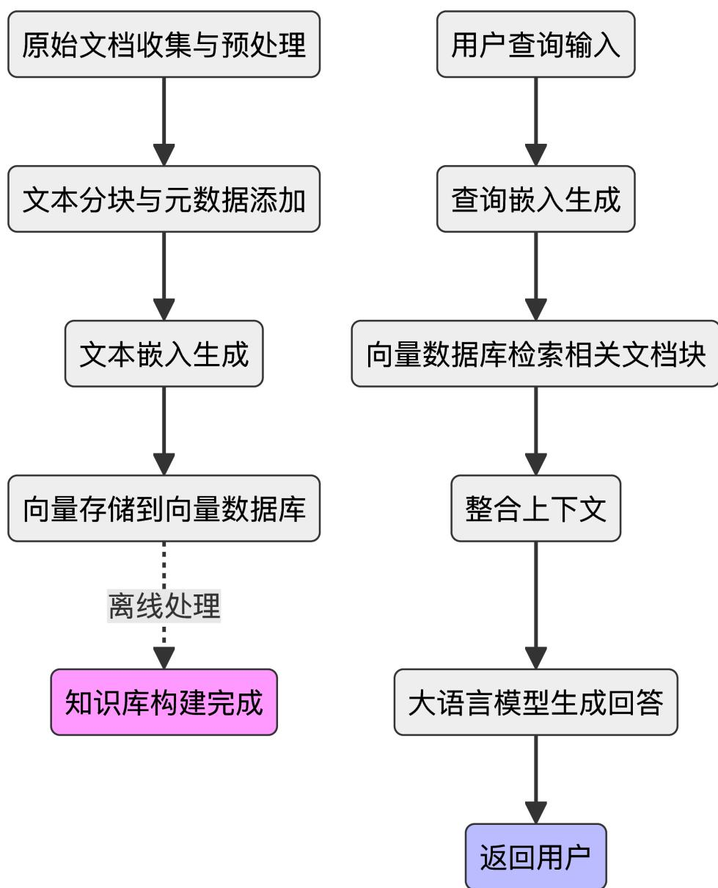
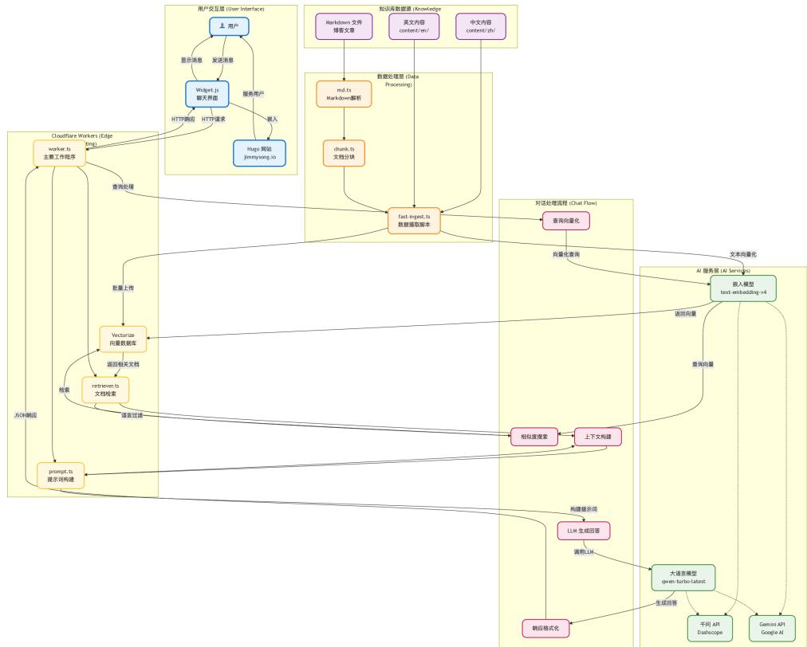
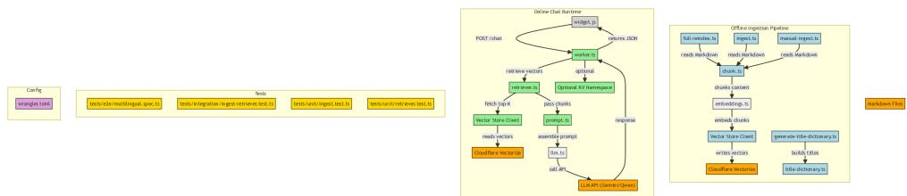
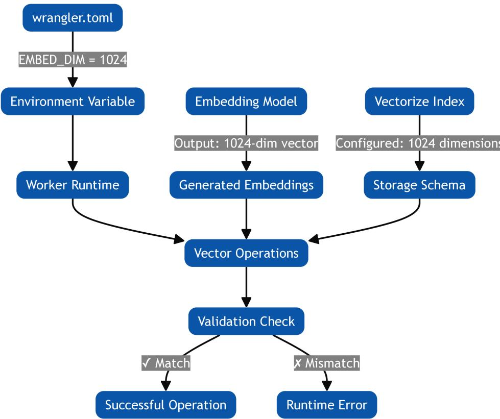
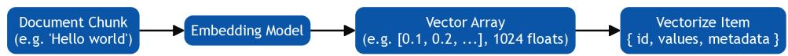
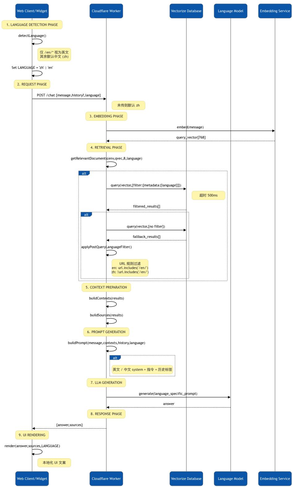
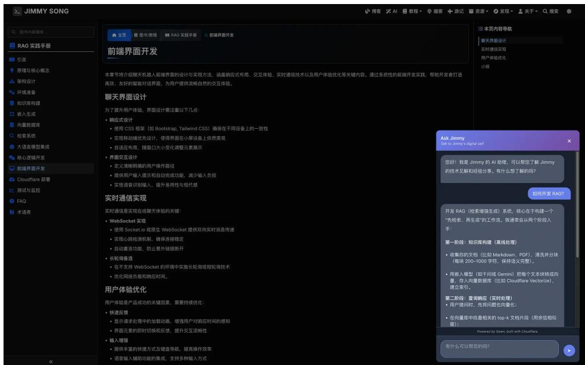
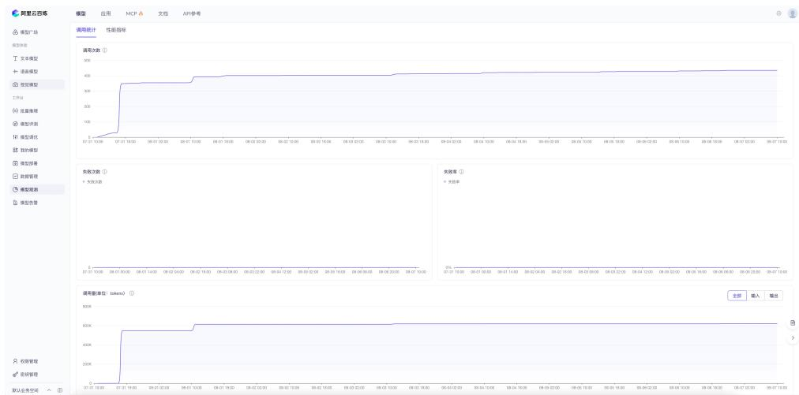
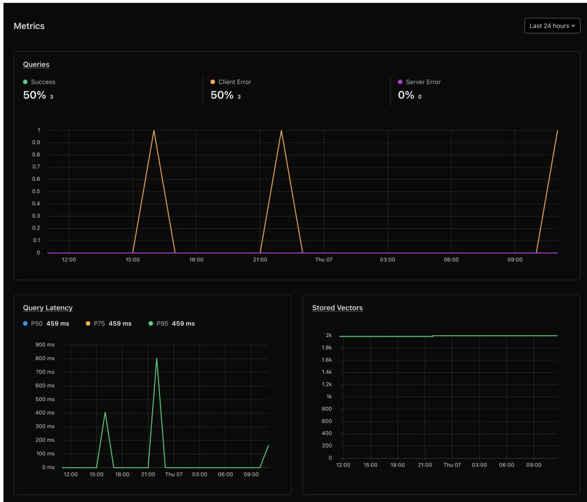
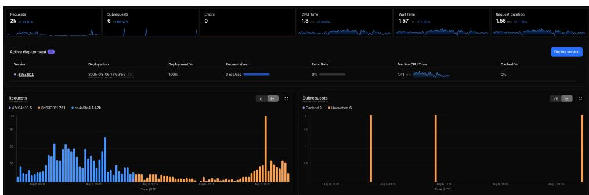

# RAG 应用开发 与实战手册

# 构建长期复利型 知识基础设施

Jimmy Song 

https://jimmysong.io/book/rag-handbook 

## 目录

1 引言 1
1.1 主要内容 1
1.2 面向读者 1
1.3 阅读本书的基础知识 2
2 RAG 原理与核心概念 3
2.1 什么是 RAG 3
2.2 RAG 的工作流程 3
2.3 RAG 参考架构 5
2.3.1 RAG 参考架构的两大阶段 5
2.3.2 RAG 的分类 5
2.3.3 RAG 架构的优势 6
2.4 小结 7
3 技术栈选择与架构设计 8
3.1 整体架构概览 8
3.2 项目结构 8
3.3 Cloudflare RAG 参考架构 10
3.4 核心技术栈介绍 10
3.4.1 Cloudflare Vectorize 架构细节 11
3.5 技术栈选择的考量 12
3.5.1 Vectorize 的独特优势 12
3.6 小结 13
4 RAG 流水线总览 14 

## 目录

4.1 总体架构流程图 14  
4.2 模块职责速览 14  
4.3 关键参数一览 15  
4.4 语言策略概述 16  
4.5 常见演进路线 16  
4.6 小结 17  
5 环境准备与依赖安装 18  
5.1 开发环境要求 18  
5.2 必要的API申请 18  
5.3 Cloudflare服务配置 19  
5.3.1 注册和配置Cloudflare 19  
5.3.2 创建Vectorize索引 19  
5.3.3 创建元数据索引 20  
5.3.4 查看索引信息 21  
5.4 项目初始化 21  
5.4.1 环境变量配置 22  
5.5 验证配置 22  
5.6 小结 23  
6 知识库数据收集 24  
6.1 数据源选择 24  
6.2 收集脚本示例 24  
6.3 小结 26  
7 Vectorize数据结构说明 27  
7.1 向量条目Schema概览 27  
7.2 ID生成策略 28  
7.3 URL归一化与语言标记 28  
7.4 分块与元数据截断原则 29  
7.5 写入（Upsert）批次 29 

7.6 删除与清空策略 29
7.7 容量与维度规划 30
7.7.1 EMBED_DIM 对齐关系图 30
7.8 观测与指标 32
7.9 风险与缓解 32
7.10 演进方向 32
7.11 小结 33
8 嵌入生成与向量化 34
8.1 选择合适的嵌入模型 34
8.1.1 常用嵌入模型及其维度 34
8.2 文档向量化处理 36
8.2.1 批量向量化处理 36
8.3 向量存储与索引 37
8.3.1 Vectorize 向量格式 37
8.3.2 向量元数据设计 38
8.3.3 批量上传到 Vectorize 38
8.3.4 命名空间管理 39
8.3.5 向量更新策略 39
8.4 小结 40
9 Markdown 向量映射 41
9.1 路径与 Front-matter 41
9.2 分块算法 chunkText() 42
9.3 短 ID 生成 generateShortId() 42
9.3.1 ID ↔ Chunk Index 关系与示例 43
9.4 元数据结构与字段 44
9.4.1 可视化映射表 (Visual Mapping Table) 44
9.4.2 截断与容量控制原则 46
9.4.3 删除 / 清空策略摘要 47
9.4.4 风险与缓解摘要 48
9.4.5 演进方向速记 48 

## 目录

9.5 processFile() 文件处理流水线 48
9.6 URL 归一化 toUrlFromPath() 49
9.7 批量 Upsert /admin/upsert 50
9.8 小结 51
10 Qwen 向量嵌入机制 52
10.1 提供方能力对比 52
10.2 高性能参数 53
10.3 Qwen 批量实现 53
10.4 维度规整 53
10.5 错误弹性 54
10.6 小结 54
11 使用 Cloudflare Vectorize 构建向量数据库 55
11.1 什么是 Cloudflare Vectorize 55
11.2 Vectorize 在 RAG 系统中的作用 55
11.3 创建 Vectorize 索引 56
11.3.1 索引配置参数 56
11.3.2 距离度量类型 56
11.3.3 创建索引命令 56
11.3.4 索引命名规范 56
11.4 绑定 Vectorize 到 Worker 57
11.5 向量操作详解 57
11.5.1 插入向量 57
11.5.2 更新向量 58
11.5.3 查询向量 58
11.5.4 根据 ID 查询向量 59
11.5.5 获取向量信息 59
11.5.6 删除向量 59
11.6 元数据索引 59
11.6.1 创建元数据索引 60
11.6.2 使用元数据过滤 60 

11.7 Vectorize 限制和最佳实践 ..... 60
11.7.1 计费说明 ..... 60
11.7.2 最佳实践 ..... 61
11.8 小结..... 61

12 检索系统实现 ..... 63
12.1 相似度搜索算法 ..... 63
12.1.1 Cloudflare Vectorize 中的距离度量 ..... 63
12.2 检索结果排序与过滤 ..... 64
12.2.1 使用 Vectorize 进行检索 ..... 64
12.2.2 元数据过滤 ..... 64
12.2.3 命名空间过滤 ..... 65
12.3 检索效果优化 ..... 66
12.3.1 Vectorize 查询优化技巧 ..... 66
12.3.2 查询性能监控 ..... 67
12.4 小结..... 67

13 检索请求流转 ..... 68
13.1 入口与查询向量 ..... 68
13.2 优先语言检索阶段 ..... 68
13.3 回退检索与二次过滤 ..... 69
13.4 上下文拼接与来源列表 ..... 69
13.5 日志结构与可观测性 ..... 69
13.6 改进方向 ..... 70
13.7 小结..... 70

14 大语言模型集成 ..... 71
14.1 千问大模型 API 接入 ..... 71
14.2 RAG 系统中的千问集成 ..... 72
14.2.1 环境配置 ..... 72
14.2.2 API 密钥设置 ..... 72
14.2.3 大语言模型调用实现 ..... 72 

## 目录

14.2.4 嵌入模型调用实现 73  
14.3 提示词工程与优化 74  
14.3.1 多语言支持 74  
14.4 模型参数调优 74  
14.5 调试和故障排除 75  
14.5.1 日志输出 75  
14.5.2 错误处理 75  
14.5.3 调试端点 75  
14.6 小结 76  
15 答案生成流程 77  
15.1 完整 RAG 流程概览 77  
15.2 提示词结构（示例：中文） 77  
15.3 关键说明：向量不直接进入 LLM 78  
15.4 llmGenerate() 调用 Qwen 示例 78  
15.5 模型响应示例 78  
15.6 小结 79  
16 聊天机器人核心逻辑开发 80  
16.1 对话流程设计 80  
16.2 上下文管理 81  
16.2.1 向量检索上下文 82  
16.2.2 对话历史管理 83  
16.3 异常处理与降级策略 83  
16.3.1 API 调用错误处理 84  
16.3.2 语言过滤超时处理 84  
16.3.3 回退机制 85  
16.3.4 完整的错误响应处理 85  
16.4 小结 86  
17 多语言支持 87  
17.1 原始序列图（Sequence Diagram） 87 

17.2 关键环节解析 87  
17.2.1 客户端语言检测 87  
17.2.2 Ingestion 阶段元数据写入 87  
17.2.3 检索阶段两级策略 89  
17.2.4 Prompt 构建语言分支 89  
17.2.5 回答与前端渲染 89  
17.3 检索回退伪代码示例 89  
17.4 手动向量更新说明 90  
17.5 已解决问题简述 90  
17.6 改进建议概览 90  
17.7 小结 90  
18 全量重索引迁移指南 92  
18.1 迁移动因 92  
18.2 环境准备 93  
18.3 操作流程 93  
18.4 清空阶段说明 94  
18.5 Ingest 高并发阶段 94  
18.6 小结 94  
19 前端界面开发 95  
19.1 聊天界面设计 95  
19.2 实时通信实现 96  
19.3 用户体验优化 96  
19.4 Widget 组件实现详解 96  
19.4.1 自适应界面设计 97  
19.4.2 多语言支持 97  
19.4.3 拖拽与定位功能 97  
19.4.4 消息展示与交互 97  
19.4.5 滚动控制 98  
19.5 嵌入方式 98 

## 目录

19.6 样式与主题 98  
19.7 小结 98  
20 Cloudflare 部署 99  
20.1 Cloudflare Workers 配置 99  
20.1.1 配置路由 99  
20.1.2 管理环境变量 100  
20.2 Vectorize 向量数据库设置 100  
20.2.1 创建向量索引 100  
20.2.2 向量索引配置 100  
20.3 部署流程 100  
20.3.1 环境准备 100  
20.3.2 依赖安装 101  
20.3.3 本地开发测试 101  
20.3.4 生产环境部署 101  
20.4 前端 Widget 集成 101  
20.5 环境变量配置详解 102  
20.6 数据导入 102  
20.7 监控与日志 103  
20.8 故障排除 103  
20.9 小结 103  
21 测试、监控与持续改进 105  
21.1 功能测试与验证 105  
21.2 性能与模型监控 106  
21.3 用户反馈收集与迭代优化 106  
21.4 小结 108  
22 常见问题与解决方案 109  
22.1 如何在保持对话连贯性的同时确保向量检索的准确性？ 109  
22.1.1 问题描述 109  
22.1.2 解决方案架构 109 

22.1.3 效果对比 110
22.1.4 最佳实践建议 110
22.2 文档 ID 和向量 ID 如何关联? 110
22.2.1 ID 生成规则 110
22.3 如何手动更新特定文档的向量? 111
22.3.1 创建手动上传脚本 111
22.3.2 使用方法 112
22.3.3 向量更新机制 112
22.4 如何为聊天组件支持多语言? 113
22.5 Vectorize 相关问题 114
22.5.1 如何选择合适的维度和距离度量? 114
22.5.2 为什么我的向量查询返回空结果? 114
22.5.3 如何优化 Vectorize 查询性能? 114
22.5.4 如何处理 Vectorize 的限制? 115
22.5.5 如何监控 Vectorize 使用情况? 115
22.6 费用问题 116
22.6.1 千问大模型 116
22.6.2 Cloudflare Worker 116
22.6.3 Cloudflare Vectorize 116
22.7 小结 117
23 术语表 118
23.1 基础模型与架构 118
23.2 RAG 相关技术 118
23.3 提示工程技术 119
23.4 模型训练与优化 119
23.5 评估与度量 120
23.6 系统架构与部署 120
23.7 AI 安全与伦理 120
23.8 其他重要概念 120 

## 第 1 章

# 引言

在人工智能技术日新月异的今天，越来越多的人希望能够拥有属于自己的智能助手，提 升工作效率、优化知识管理，甚至打造个人品牌。《RAGHandbook》正是为此而生。 本书将系统性地介绍如何从零开始，基于 RAG（Retrieval‑Augmented Generation， 检索增强生成）技术，构建一个能够理解和利用个人知识库的智能聊天机器人，并将其 无缝集成到你自己的网站或应用中。 

## 1.1 主要内容

本书内容涵盖以下几个方面： 

• RAG技术原理：深入浅出地讲解 RAG 的基本概念、核心组件(如检索器、生成器)、 主流实现方式及其在实际场景中的优势与局限。 

· 知识库构建与管理：如何整理、结构化和持续更新你的个人或企业知识库，使其适 合AI检索与生成。 

·智能聊天机器人开发：从环境搭建、模型选择、数据预处理到对话逻辑设计，逐步带 你实现一个可定制的智能助手。 

・ 前后端集成与部署：详细介绍如何将聊天机器人集成到Hugo静态网站、Web应用 或其他平台，并实现安全、稳定的线上部署。 

• 案例实战：以“个人数字分身”为例，完整演示如何让机器人回答关于你的专业领 域、经历、观点等问题，助力个人品牌建设和知识传播。 

· 进阶与扩展：介绍如何结合多语言支持、上下文记忆、插件扩展等高级功能，打造更 强大的智能系统。 

## 1.2 面向读者

本书适合以下读者阅读： 

• 对 AI技术感兴趣的初学者，希望了解 RAG 及其应用场景； 

・ 有一定编程基础的开发者，想要动手实践智能助手开发； 

• 企业或个人希望构建专属知识库和智能问答系统的技术爱好者： 

・ 关注个人品牌、内容创作和知识管理的自媒体人、教育者等。 

## 1.3 阅读本书的基础知识

本书需要以下基础知识： 

・ 熟悉Markdown文档编辑； 

・ 了解基本的命令行操作； 

・ 有一定的编程经验（如Python、Node.js），但无需深厚的AI/机器学习背景； 

・ 对Hugo静态网站或Web应用有基本了解更佳。 

通过本书的学习，你不仅能够掌握RAG技术的核心原理和开发流程，还能亲手打造一 个属于自己的智能聊天机器人，让AI真正为你的知识管理和个人成长赋能。 

## 第 2 章

# RAG原理与核心概念

RAG（检索增强生成）技术通过结合信息检索和生成式AI，有效解决了传统大语言模型 的知识截止、幻觉等问题。本章将深入解析RAG的核心概念和工作原理，详细介绍其 两阶段处理流程：离线的知识库构建和实时的查询响应。我们还将探讨Cloudflare提 供的RAG参考架构，帮助您理解如何在实际项目中应用这些概念，构建高效、可靠的 AI应用系统。 

## 2.1 什么是 RAG

RAG（Retrieval‑Augmented Generation，检索增强生成）是一种将信息检索与生成式 AI相结合的技术架构。它通过以下方式解决了传统大语言模型的关键问题： 

传统LLM的局限性： 

•知识截止点：模型训练数据有时间限制，无法获取最新信息 

・ 幻觉问题：模型可能生成看似合理但实际错误的信息 

• 领域专业性不足：对特定领域的深度知识掌握有限 

・ 个性化缺失：无法基于用户的个人知识库进行回答 

RAG的解决方案： 

RAG通过引入外部知识库，让AI模型在生成回答前先检索相关信息，从而显著提高回 答的准确性和时效性。这种方法特别适合构建个人数字分身，因为它可以基于你的个人 文档、博客文章、经验总结等生成符合你风格和观点的回答。 

## 2.2 RAG 的工作流程

RAG系统的工作流程分为两个主要阶段：知识库构建（离线处理）和查询响应（实时 处理）。 

$$
\{\text { width } = 1 9 2 0 \text {   height } = 2 3 5 4 \}
$$

在知识库构建阶段，首先需要收集和预处理各种格式的文档（如Markdown、PDF、 TXT)，清理无关内容并标准化文本。随后，将长文档合理分块，确保语义完整，并为每 个文本块添加元数据(如标题、来源、时间)。接着，利用嵌入模型将这些文本块转换 为高维向量，捕捉其语义信息，并将向量存入向量数据库以便后续检索。 




图 2-1: RAG 工作流程示意图


进入查询响应阶段，系统会将用户的问题同样通过嵌入模型转为向量，并在向量数据库 中检索出最相关的文档块（通常基于余弦相似度或欧氏距离，返回top‑k结果）。这些 检索到的内容会被整合为上下文，与用户问题一起构建提示词，最终交由大语言模型生 成基于事实的准确回答，并返回给用户。 

## 2.3 RAG 参考架构

以下内容为 Cloudflare 官方提供的RAG 参考架构示例，旨在帮助理解主流无服务器 RAG系统的设计思路，并非本项目实际采用的架构。实际部署时可根据自身需求进行 调整和优化。详情请参考 Build a Retrieval Augmented Generation (RAG) AI。 

Cloudflare提供了一套完整的RAG参考架构，展示了如何在无服务器环境中构建高效、 可扩展的RAG系统。该架构充分利用了Cloudflare的边缘计算平台和相关服务。 

## 2.3.1 RAG参考架构的两大阶段

RAG系统的实现通常分为两个核心阶段，每个阶段都承担着关键的功能 

## ・ 知识库构建阶段（Knowledge Seeding）

在这一阶段，原始文档会被上传至系统，经过初步处理后，消息被异步推送到队列 中。消费者进程会批量处理这些文档，利用嵌入模型将文本转化为高维向量，并存 入向量数据库以便后续检索。同时，原始文档也会被持久化保存。整个流程通过队 列机制实现任务的可靠传递和重试，确保数据一致性和处理的健壮性。 

## ・ 知识查询阶段（Knowledge Queries）

用户发起查询请求后，系统会将查询内容转化为向量，并在向量数据库中检索最相 关的文档片段。随后，系统根据检索结果从持久化数据库中获取原始文档，将这些 内容与用户查询一同传递给生成模型，最终生成基于事实的响应。 

这种架构充分利用了CloudflareWorkers的无服务器和边缘计算能力，结合Queues 的异步处理、WorkersAI的嵌入与生成、Vectorize的高效检索以及D1的数据持久化， 开发者可以快速搭建高性能、可扩展的RAG应用。 

## 2.3.2 RAG 的分类

在RAG技术的发展过程中，研究者和工程师们提出了多种不同的RAG架构。RAG架构 可以根据其提出动因和主要特点分为以下几类： 

## 1. Naive RAG

提出动因：LLM容易出现“幻觉”，参数化知识难以更新，需要外部检索补充知识并提 供可追溯的证据。 

主要特点：采用三步流程（文档切块→向量检索→拼接提示生成），支持一体化端到 端微调（如RAG‑Sequence和RAG‑Token），能够减少模型幻觉，提升开放域问答的准 确率。 

## 2. Advanced RAG

提出动因：用户查询与知识库语义不完全对齐，NaiveRAG检索噪声较多、生成质量 有限。 

主要特点：引入预检索（如查询重写/扩展）、检索（语义向量检索）、后检索（结果重排 序、摘要压缩）等多阶段处理，显著提升检索相关性和生成质量。 

## 3. Modular RAG

提出动因：随着检索器、LLM等组件快速迭代，传统管道难以快速集成新功能，维护成 本高。 

主要特点：将整个流程拆分为可插?的七大模块（如 Indexing、Pre Retrieval、 

Retrieval、Post Retrieval、Memory、Generation、Orchestration），支持检索、重排 序、压缩、生成等功能模块化组合，并引入路由、调度、融合算子，实现灵活扩展和多 种RAG模式（线性、条件、分支、循环）。 

## 4. Agentic RAG

提出动因：需要处理复杂多步任务和多轮决策，单轮静态流程已无法满足需求，希望结 合检索与规划能力。 

主要特点：采用多智能体架构，由主智能体协调子智能体，具备动态决策能力（自主判 断何时检索、何时生成），支持多轮迭代和任务自校正，提升复杂任务的适应性和鲁 棒性。 

需要注意的是，本书中使用的 RAG 示例属于 Advanced RAG 类型。它不仅实现了基础 的检索和生成流程，还包含了查询重写、结果重排序等高级功能，以提高检索准确性和 生成质量。 

## 2.3.3 RAG 架构的优势

RAG架构的优点包括： 

• 回答更准确可靠，内容可追溯到具体文档 

・ 支持个性化和专业化知识库，适合数字分身场景 

• 无需训练专用模型，知识库可实时更新，维护成本低 

• 系统具备自动扩缩容和全球低延迟服务能力 

RAG架构不仅提升了聊天机器人的智能水平，也极大降低了开发和维护的门槛，为各 

类AI应用提供了坚实的基础。 

## 2.4 小结

RAG技术通过将信息检索与生成式AI相结合，解决了传统大语言模型的知识截止、幻 觉等问题。通过离线的知识库构建和实时的查询响应流程，RAG系统能够提供准确、可 靠的回答，并支持个性化和专业化的知识库构建。Cloudflare的RAG参考架构展示了 如何在无服务器环境中实现高效、可扩展的RAG系统，为开发者提供了宝贵的实践 经验。 

## 第 3 章

# 技术栈选择与架构设计

良好的架构设计是构建高效、可扩展的RAG系统的基础。本章将深入探讨我们为聊天 机器人选择的技术栈，包括 Cloudflare Workers、Vectorize向量数据库以及千问大语 言模型等核心组件。我们将详细解析整体架构的各个层次，介绍Cloudflare提供的 RAG参考架构，并分析Vectorize在系统中的关键作用。通过理解这些设计决策，您将 能够构建出既满足当前需求又具备未来扩展性的AI应用。 

## 3.1 整体架构概览

我们的RAG聊天机器人采用了现代化的无服务器架构，整个系统可以分为数据源层 数据处理层、存储层、计算层、AI服务层和展示层等核心层次。整个系统的数据流程可 以分为数据摄取阶段（离线）和对话交互阶段（实时）两个主要部分。 

下图展示了RAG聊天机器人的架构。 

{width=2403 height=1944} 

在数据摄取阶段，系统会从Hugo网站的 content/ 目录收集Markdown文档，使用 fast‑ingest.ts 脚本解析并分块文档内容，通过千问或GeminiAPI生成文档嵌入向 量，最后将向量和元数据存储到 Cloudflare Vectorize 数据库中。 

在对话交互阶段，用户通过网站上的聊天Widget 发送问题，Cloudflare Worker接收 请求并向量化用户查询，在Vectorize中检索最相关的文档片段，构建包含上下文的提 示词，调用大语言模型生成回答，最后返回格式化的响应给用户。 

## 3.2 项目结构

下图展示了聊天机器人项目结构图： 

{width=2839 height=615} 

本项目采用模块化架构，分为离线数据处理、在线对话服务、前端交互、配置管理和测 试验证五大部分： 

・ 离线数据处理（Ofine Ingestion Pipeline） 




图3‑1: RAG聊天机器人架构





图3‑2: 聊天机器人项目结构


负责将Markdown内容分块、生成嵌入向量、构建标题字典，并将处理结果写入向 full‑reindex.ts ingest.ts 、 manual‑ingest.ts 、 chunk.ts等，支持自动化和手动数据更新。 

## ・ 在线对话服务（Online Chat Runtime）

通过Cloudflare Worker实现对话逻辑，包括消息接收、向量检索、提示词构建和大 语言模型调用。核心文件有 worker.ts 、retriever.ts 、 prompt.ts 、llm.ts ，支持 多轮对话和上下文管理，并可选用KV存储持久化会话状态。 

## ・ 前端交互（Frontend）

提供用户界面，负责消息发送和结果展示。主要文件为 widget.js，通过 HTTP POST与后端Worker 通信，实现实时对话体验。 

## ・ 配置管理（Confg）

使用 wrangler.toml 管理 Cloudflare Worker 部署配置，包括环境变量、命名空间 和服务参数，确保多环境一致性和可扩展性。 

## ・ 测试验证（Tests）

包含端到端、多语言、集成和单元测试，覆盖数据处理、检索和对话逻辑。测试文件 如 multilingual.spec.ts 、 ingest‑retriever.test.ts 、 ingest.test.ts 、 

retriever.test.ts ，保障系统稳定性和功能正确性。 

整体结构支持多语言内容、智能检索与生成、异常处理和降级策略，便于扩展和维护， 适合构建高可用、智能化的聊天机器人系统。 

## 3.3 Cloudfare RAG 参考架构

Cloudflare提供了一套RAG参考架构，展示了如何在无服务器环境中构建高效、可扩 展的RAG系统。该架构充分利用了Cloudflare的边缘计算平台和相关服务。 

在知识库构建阶段，系统会自动从Hugo网站的 content/ 目录收集 Markdown 文档， 通过本地或云端脚本（如 fast‑ingest.ts ）进行内容解析和分块，然后调用千问或 Gemini等嵌入模型生成文档向量，最终将向量及其元数据直接存储到Cloudflare Vectorize向量数据库中。整个流程无需消息队列或关系型数据库，简化了架构，提升 了处理效率。 

在知识查询阶段，用户通过网站聊天 Widget 提交问题，Cloudflare Worker 作为 API 端点接收请求，首先将用户查询转化为向量表示，然后在Vectorize中检索最相关的文 档片段。检索结果与原始查询一同构建提示词，调用大语言模型（如千问或Gemini) 生成最终回答，并将响应返回给用户。 

该架构的主要优势包括：充分利用Cloudflare Workers的无服务器特性，自动扩缩容， 无需服务器运维；依托全球200多个数据中心的边缘计算能力，提供低延迟响应；架构 简洁，组件解耦，便于扩展和维护；按使用量计费，具备良好的成本效益。 

通过采用这种架构，开发者可以快速构建和部署高性能的RAG应用，充分发挥 Cloudflare 全球网络和 Vectorize 服务的优势。 

## 3.4 核心技术栈介绍

在后端架构方面，我们选择了Cloudflare Workers 作为边缘计算平台，提供全球分布 的低延迟响应，同时使用Cloudflare Vectorize 作为向量数据库，存储文档嵌入和处理 相似度搜索，并采用TypeScript作为开发语言以确保类型安全。 

AI模型服务方面，系统支持千问（Qwen）和Google的Gemini两种选择。千问是阿 里云提供的大语言模型和嵌入模型，特别适合中文内容处理，而Gemini是Google提 供的多模态AI模型，适合处理多种类型的内容。嵌入模型可以选择千问的 text‑embedding‑v4 或 Gemini 的 text‑embedding‑004。 

对于中国大陆用户，建议使用千问模型，因为Google的服务在中国被封禁，而且千问 模型在中文处理上表现更佳。千问的嵌入模型（如 text‑embedding‑v4 ）和大语言模型 （如 qwen‑turbo‑latest ）都提供了高质量的中文支持，且更具成本优势（只有 Gemini API约一半的价格)。 

前端组件方面，我们使用Widget.js作为轻量级聊天界面，支持Markdown渲染，同时 采用Hugo作为静态网站生成器进行内容管理，并实现响应式设计以支持桌面和移动 设备。 

在开发工具方面，使用 Wrangler 作为 Cloudflare Workers 的开发和部署工具， Node.js作为本地开发和数据处理环境，并采用npm或pnpm作为包管理器。 

## 3.4.1 Cloudfare Vectorize 架构细节

Vectorize在整体架构中扮演着关键角色，它连接了数据处理和实时查询两个阶段： 

## 3.4.1.1 数据流设计

1. 向量生成流程： 

```txt
1 Markdown 文档 → 文本分块 → 嵌入模型 → 向量表示 → Vectorize 存储 
```

2. 向量查询流程： 

```txt
1 用户查询 → 嵌入模型 → 查询向量 → Vectorize 检索 → 相关文档 
```

## 3.4.1.2 数据模型设计

Vectorize中存储的向量包含以下关键组成部分： 

1. 向量ID：唯一标识符，通常基于文档路径和块索引生成 

2. 向量值：由嵌入模型生成的数值数组 

3. 元数据：与向量关联的描述性信息 

4. 命名空间：可选的向量分组标识 

示例向量结构： 

```txt
1 {
2 id: "a1b2c3d4-0", // 基于文档路径和块索引生成的唯一 ID
3 values: [0.12, 0.45, 0.67, /* ... 1024 个维度 ... */], // 1024 维向量 
```

```txt
metadata: {
    url: "https://jimmysong.io/blog/launch-ai-resource-page", // 文档 URL
    title: "RAG 聊天机器人指南", // 文档标题
    sourcePath: "content/zh/blog/launch-ai-resource-page/index.md", // 源文件路径
    chunkIndex: 0, // 块索引
    language: "zh", // 语言
    tags: ["AI", "RAG", "Cloudflare"], // 标签
    createdAt: "2025-07-31T10:00:00Z", // 创建时间
    wordCount: 256 // 字数统计
},
namespace: "zh" // 命名空间（可选）
} 
```

## 3.4.1.3 查询优化策略

为了提升查询性能，Vectorize采用了多项优化措施。首先，系统会自动优化向量索引 结构，确保在大规模数据集下依然能够高效检索。默认采用近似搜索算法，在保证检索 准确性的同时显著提升响应速度。对干常用的过滤字段，Vectorize 支持元数据索引 便于实现基于标签、语言等属性的高效筛选。此外，通过命名空间机制，可以实现数据 的逻辑隔离和针对性查询优化，满足多租户或多语言场景下的需求。 

## 3.5 技术栈选择的考量

本系统之所以采用当前的技术栈，主要基于以下几个方面的综合考量： 

• 首先，Cloudflare Workers提供了全球 200多个数据中心的边缘计算能力，能够实 现平均低于50ms的响应延迟，并支持自动扩缩容，极大简化了运维工作。 

• 按请求计费模式和Vectorize的免费额度，使得整体方案具备良好的成本效益，尤其 适合个人博客和小型项目的快速上线。 

・ 在开发体验方面，TypeScript的类型安全保障和支持热重载的开发环境，使得开发 流程更加高效和可靠。结合模块化架构设计，系统能够灵活集成多种AI服务商，并 原生支持中英文等多语言内容，具备良好的可扩展性。 

## 3.5.1 Vectorize 的独特优势

在众多向量数据库方案中，Cloudflare Vectorize 具备无缝集成 Cloudflare Workers 的 能力，配置简单，易于上手。依托Cloudflare全球网络，能够为用户提供低延迟的向 量检索服务。后台自动优化索引，支持单索引多达500万个向量，满足大规模应用需 求。计费方式透明，按查询和存储维度计费，无隐藏费用。丰富的元数据支持和命名空 间机制，进一步提升了数据管理和查询的灵活性。这些特性共同构成了Vectorize在 RAG应用场景下的核心竞争力，使其成为快速部署和扩展AI应用的理想选择。 

## 3.6 小结

通过本章的介绍，您已经对RAG聊天机器人的整体架构和核心技术栈有了清晰的认识。 Cloudflare Workers 和 Vectorize 的无服务器架构设计，使得系统具备高性能、低延迟 和易扩展的特点。接下来，我们将深入探讨RAG技术的原理和实现细节，帮助您更好 地理解如何构建一个智能、高效的聊天机器人系统。 

## 第 4 章

## RAG流水线总览

本章充当导航：快速把握系统各阶段职责，并指向后续详细章节。核心链路：内容→ 向量化→索引→检索→Prompt→回答。带你快速了解RAG流水线的整体架构与各 模块分工，帮助建立全局认知。 

## 4.1 总体架构流程图

下方列举了RAG流水线的主要处理步骤，涵盖从内容接入到答案生成的完整流程： 

1. Markdown 内容 

2. 解析 + Front‑matter 

3. 分块 chunkText 

4. 批量嵌入（Gemini/Qwen） 

5. 向量规整/裁剪 

6. 批量 Upsert Vectorize 

7. 检索（查询+过滤+回退） 

8. 上下文拼装 

9. Prompt 构建 

10. LLM 生成 

11. 引用+答案返回 

各环节紧密衔接，确保内容高效流转与处理。 

## 4.2 模块职责速览

下表简要梳理了各阶段的主要职责及关注点，便于快速定位后续章节： 

<table><tr><td>阶段</td><td>章节</td><td>主要职责</td><td>关键点</td></tr><tr><td>分块</td><td>向量映射</td><td>Markdown → 标题/句级切分</td><td>语义保持 + 长度控制</td></tr><tr><td>嵌入</td><td>Qwen 嵌入</td><td>批量/并发/维度规整</td><td>成本与吞吐平衡</td></tr><tr><td>存储</td><td>数据结构</td><td>Schema 最小化 / ID / URL 规范</td><td>控制容量 + 语言标记</td></tr><tr><td>检索</td><td>检索流程</td><td>语言优先 + 回退</td><td>低延迟 + 召回稳健</td></tr><tr><td>生成</td><td>答案生成</td><td>Prompt 组装 + LLM 调用</td><td>上下文相关性与引用</td></tr><tr><td>维护</td><td>重建索引</td><td>全量重建流程与指标</td><td>模型/策略升级支持</td></tr></table>

## 4.3 关键参数一览

流水线各环节涉及多个关键参数，以下表格汇总常用配置及示例： 

<table><tr><td>名称</td><td>描述</td><td>示例</td></tr><tr><td>EMBED_DIM</td><td>向量维度(索引/模型一致)</td><td>1024</td></tr><tr><td>EMBED-DING_BATCH_SIZE</td><td>单次嵌入批大小</td><td>10 (Qwen) / 1 (Gemini)</td></tr><tr><td>UP-LOAD_BATCH_SIZE</td><td>/admin/upsert 每批项目数</td><td>300</td></tr><tr><td>MAX_CONCURRENT_FILES</td><td>文件并行解析上限</td><td>15</td></tr><tr><td>MAX_CONCURRENT_EMBEDDINGS</td><td>并发嵌入请求上限</td><td>25</td></tr><tr><td>topK</td><td>检索返回片段数</td><td>8</td></tr></table>

合理设置参数有助于提升系统性能与稳定性。 

## 4.4 语言策略概述

RAG流水线支持多语言内容处理，以下简要介绍语言相关的核心策略： 

1. Ingest 写入 language 

2. 查询先metadata过滤，失败回退全量 

3. URL 二次过滤（/en/ 前缀） 

4. Prompt 指令与标签双语化 

5. 源链接返回保持原语言路径结构 

多语言机制确保检索与生成环节的准确性和一致性。 

## 4.5 常见演进路线

系统可持续演进，常见优化方向如下： 

・ 引入增量更新（文件hash/mtime） 

・ Rerank 二阶段重排 

• 条件删除接口 & 过期策略 

• 上下文压缩（语义聚合+动态裁剪） 

• 多模型路由（按主题/语言切换嵌入提供方） 

这些策略有助于提升系统扩展性与灵活性。 

## 4.6 小结

通过模块解耦与批量/并发优化，RAG流水线实现了高效可扩展的端到端处理。后续章 节将详细介绍各环节的实现细节与优化策略。 

## 第 5 章

# 环境准备与依赖安装

在开始构建RAG聊天机器人之前，合理的环境配置是确保项目顺利进行的关键。本章 将指导您完成所有必要的环境设置，包括Node.js和WranglerCLI的安装、各API服 务的申请与配置，以及Cloudflare Vectorize向量数据库的初始化。通过按照本章步骤 操作，您将建立起一个完整的开发环境，为后续的开发工作奠定坚实基础。 

## 5.1 开发环境要求

为了构建和运行RAG聊天机器人，你需要准备以下开发环境： 

・ Node.js 20 或更高版本 

・ npm 或 pnpm 作为包管理器 

・ Cloudflare Wrangler CLI 用于开发和部署 

## 5.2 必要的 API 申请

根据你的选择，你需要申请不同的 API密钥： 

千问（Qwen）API申请步骤： 

1. 访问阿里云百炼平台 

2. 注册并完成实名认证 

3. 开通大模型服务，选择合适的付费方案 

4. 获取 API Key 和 Base URL 

5. 记录以下信息： 

QWEN_API_KEY : 你的 API 密钥 

QWEN_BASE : API 基础 URL（通常是 

https://dashscope.aliyuncs.com/compatible‑mode/v1 ） 

Google Gemini API 申请步骤： 

1. 访问 Google AI Studio 

2. 登录 Google 账号 

3. 创建新的API密钥 

```txt
4. 记录 GOOGLE_API_KEY 
```

## 5.3 Cloudfare 服务配置

## 5.3.1 注册和配置 Cloudfare

1. 注册 Cloudflare 账号 

2. 安装 Wrangler CLI： 

```batch
1 npm install -g wrangler 
```

3. 登录 Cloudflare： 

```txt
1 wrangler login 
```

## 5.3.2 创建 Vectorize 索引

Vectorize 是 Cloudflare 提供的向量数据库服务，在 RAG 系统中用于存储和检索文档 向量。 

创建索引时需要考虑以下因素： 

1. 维度匹配：索引维度必须与所使用的嵌入模型输出维度一致 

2. 距离度量：根据应用场景选择合适的距离度量方式 

3. 命名规范：使用描述性的索引名称 

```txt
1 # 为千问 text-embedding-v4 模型（1024 维）创建索引
2 wrangler vectorize create website-rag --dimensions=1024 --metric=cosine 
```

上述命令用于在 Cloudflare Vectorize 服务中创建一个名为 website‑rag 的向量索引， 适配千问 text‑embedding‑v4 模型（输出维度为 1024）。各参数说明如下： 

website‑rag：索引名称，需唯一，用于后续绑定和引用。 

‑‑dimensions：指定向量的维度，需与所用嵌入模型的输出维度一致（如 text‑embedding‑v4 为 1024）。 

--metric：指定向量相似度的计算方式，可选值包括： 

cosine：余弦相似度（推荐用于文本检索） 

euclidean ：欧氏距离 

dot‑product ：点积 

向量维度指的是每个文本被嵌入(embedding）后所生成的向量包含的数值个数。例 如，维度为1024表示每个文本会被表示为一个包含1024个浮点数的向量。一般来说， 维度越高，向量能表达的信息越丰富，检索起来就越精确，但也会带来存储和计算成本 的增加。因此，实际开发中应严格按照所选嵌入模型的输出维度进行配置，而不是自行 选择。维度的选择必须与所用嵌入模型的输出一致。例如，千问的 text‑embedding‑v4 模型输出的每个向量就是1024维。如果设置为其他数值，将导致存储和检索时维度不 匹配，无法正常使用。不同模型的输出维度可能不同，务必查阅模型文档后正确设置。 

此外， wrangler vectorize create 还支持以下常用参数： 

‑‑preset：指定预设的嵌入模型，自动配置维度和距离度量（如 

```txt
openai/text-embedding-ada-002 等)。 
```

‑‑description：为索引添加描述信息，便于管理。 

‑‑json：以JSON格式输出结果，便于脚本处理。 

‑e, ‑‑env：指定环境变量文件或环境名，适用于多环境部署。 

完整参数列表可通过 wrangler vectorize create ‑‑help 查看。建议根据实际嵌入模 型和业务需求合理设置参数，确保索引性能和检索效果。 

## 5.3.3 创建元数据索引

在向量数据库中，元数据（Metadata）是与每个向量一起存储的结构化信息，例如文 档的URL、语言、标签等。元数据本身不是CloudflareVectorize独有的概念，几乎所 有主流的嵌入数据库（如Pinecone、Weaviate、Milvus等）都支持为向量附加元数 据，并基于元数据进行过滤检索。通过为常用的元数据字段建立索引，可以高效地实现 如“按语言筛选”、“按标签过滤”等复杂查询，提升检索的灵活性和性能。 

为了支持基于元数据的过滤查询，需要为常用的元数据字段创建索引： 

```shell
# 为 URL 字段创建元数据索引
wrangler vectorize create-metadata-index website-rag --property-name=url --type=string
# 为语言字段创建元数据索引
wrangler vectorize create-metadata-index website-rag --property-name=language --type=string
# 为标签字段创建元数据索引
wrangler vectorize create-metadata-index website-rag --property-name=tags --type=string 
```

Vectorize 支持最多创建10个元数据索引，每个索引支持的类型包括： 

string：字符串类型 

number 

boolean 

## 5.3.4 查看索引信息

创建索引后，可以查看索引的详细信息： 

```txt
1 # 查看索引基本信息
2 wrangler vectorize list
3
4 # 查看索引详细信息
5 wrangler vectorize info website-rag
6
7 # 查看元数据索引
8 wrangler vectorize list-metadata-index website-rag 
```

## 5.4 项目初始化

1. 克隆项目仓库： 

```txt
git clone https://github.com/rootsongjc/rag-chatbot.git
cd rag-chatbot 
```

2. 安装 Node.js 依赖： 

```txt
1 npm install 
```

3. 配置 wrangler.toml ， 加入你的 API 密钥和 Vectorize 索引配置： 

```toml
1 name = "website-rag-worker"
2 main = "src/index.ts"
3 compatibility_date = "2024-07-31"
4
5 [vars]
6 PROVIDER = "qwen"
7 EMBED_DIM = 1024
8 LLM_MODEL = "qwen-turbo-latest"
9 EMBED_MODEL = "text-embedding-v4"
10 QWEN_API_KEY = "your-qwen-api-key"
11 QWEN_BASE = "https://dashscope.aliyuncs.com/compatible-mode/v1"
12
13 # 绑定 Vectorize 索引
14 [[vectorize]]
15 binding = "VECTORIZE"
16 index_name = "website-rag"
17
18 # 绑定 AI 模型（如果使用 Workers AI）
19 [ai]
20 binding = "AI" 
```

## 5.4.1 环境变量配置

建议将敏感信息（如API密钥）存储在环境变量中，而不是直接写在配置文件里： 

```txt
1 # 设置环境变量
2 export QWEN_API_KEY="your-qwen-api-key" 
```

或在 .dev.vars 文件中配置（仅用于开发环境）： 

```txt
1 QWEN_API_KEY=your-qwen-api-key
2 GOOGLE_API_KEY=your-google-api-key 
```

## 5.5 验证配置

配置完成后，可以通过以下方式验证设置是否正确： 

1. 测试 Vectorize 连接： 

```txt
1 # 查看索引信息
2 wrangler vectorize info website-rag 
```

2. 测试 Worker 部署： 

```txt
1 # 本地开发模式
2 wrangler dev
3
4 # 部署到 Cloudflare
5 wrangler deploy 
```

3. 创建一个简单的测试脚本来验证嵌入模型是否正常工作。 

```javascript
// test-embedding.ts
import { createEmbedding } from './src/embedding';

async function testEmbedding() {
    try {
    const testText = "这是一个测试文本";
    const embedding = await createEmbedding(testText);
    console.log('成功生成嵌入向量，维度：${embedding.length}');
    } catch (error) {
    console.error("嵌入生成失败：", error);
    }
}

testEmbedding(); 
```

通过以上步骤，你应该能够成功设置RAG聊天机器人所需的开发环境，并正确配置 

Cloudflare Vectorize 服务。 

## 5.6 小结

本章介绍了RAG聊天机器人开发所需的环境准备和依赖安装，包括Node.js、 

Wrangler CLI、API 密钥申请以及 Cloudflare Vectorize 的配置。通过这些步骤，你将 建立起一个完整的开发环境，为后续的RAG系统开发打下坚实基础。接下来，我们将 深入探讨RAG技术的原理和实现细节，帮助你更好地理解如何构建一个智能、高效的 聊天机器人系统。 

## 第 6 章

## 知识库数据收集

本章节将介绍如何系统性地收集和整理个人知识库的数据源，包括内容类型的选择、数 据收集的自动化脚本示例，以及在Hugo网站结构下的实际操作方法，帮助你高效构建 适合数字分身的知识库基础。 

## 6.1 数据源选择

对于个人数字分身，你可以收集以下类型的内容作为知识库： 

・ 个人博客文章：技术总结、思考感悟、项目经验 

・ 专业文档：工作中的技术文档、项目说明 

・ 学习笔记：读书笔记、课程总结、知识整理 

・ 演讲稿和简历：个人经历和专业背景 

• 常见问答：你经常回答的问题和标准答案 

## 6.2 收集脚本示例

创建一个数据收集脚本来遍历你的Hugo网站目录： 

```typescript
// collect-content.ts
import { readdir, readFile, stat } from 'fs/promises';
import { join } from 'path';
import matter from 'gray-matter';

interface ContentFile {
    path: string;
    title: string;
    content: string;
    metadata: Record<string, any>;
}

async function collectMarkdownFiles(dir: string): Promise<ContentFile[]> {
    const files: ContentFile[] = [];

    async function traverse(currentDir: string) {
    const entries = await readdir(currentDir); 
```

```javascript
for (const entry of entries) {
    const fullPath = join(currentDir, entry);
    const stats = await stat(fullPath);

    if (stats.isDirectory()) {
    // 跳过草稿和私有目录
    if (!entry.startsWith('.') && entry !== 'drafts') {
    await traverse(fullPath);
    }
    } else if (entry.endsWith('.md') && entry !== 'index.md') {
    const content = await readFile(fullPath, 'utf-8');
    const { data, content: markdownContent } = matter(content);

    // 只收集已发布的内容
    if (!data.draft) {
    files.push({
    path: fullPath,
    title: data.title || entry.replace('.md', '',
    content: markdownContent,
    metadata: {
    ...data,
    relativePath: fullPath.replace(dir, '',
    lastModified: stats.mtime
    }
    });
    }
    }
    }
    }
    }

    await traverse(dir);
    return files;
} 
```

在函数中，我们首先定义了一个名为files的空数组，用于存储遍历到的文件。然后， 我们定义了一个名为traverse的递归函数，用于遍历指定目录下的所有文件。在 traverse 函数中，我们使用 readdir 方法读取当前目录下的所有条目，并使用 stat 方法获取每个条目的状态信息。对于每个条目，如果是目录且不是草稿或私有目录，则 递归调用traverse继续遍历；如果是 Markdown 文件且不是index.md，则读取文件 内容并解析 front matter，最后将符合条件的文件信息存入files数组。 

在处理知识库时，脚本应考虑以下事项： 

・ 跳过草稿和私有内容：脚本应跳过 drafts 目录、以点（.）开头的隐藏目录，以及 front matter中draft：true的文件，避免收集未发布或私有内容。 

• 跳过大段代码引用：如内容中包含大量代码块，可根据实际需求选择是否收集，或 对代码块进行截断、摘要处理，防止知识库被无关代码淹没。 

・ 文件结构与多语言支持：Hugo多语言站点通常有 /zh/ 和 /en/ 目录，收集时需分 别处理，确保不同语言的内容都能纳入知识库。你也可以仅收录一种语言，大模型 也可以仅根据一种语言构建，避免多语言内容混淆。 

・ 元数据完整性：建议每个Markdown文件都包含 title 字段，并根据实际需要补充 description 、 date等元数据，便于后续检索和分析。 

・ 自动化与可扩展性：脚本可根据内容类型、标签等条件灵活过滤，支持后续扩展（如 同步到向量数据库、生成摘要等)。 

• 路径处理：建议统一使用相对路径，便于后续迁移和索引。 

通过遵循上述注意事项，可以高效、规范地收集和管理个人知识库内容，为数字分身等 下游应用打下坚实基础。 

## 6.3 小结

通过本章的介绍，你已经了解了如何系统性地收集和整理个人知识库的数据源。我们提 供了一个示例脚本，帮助你自动化地遍历Hugo网站目录并提取有价值的内容。接下 来，你可以将这些数据存储到向量数据库中，为构建基于RAG技术的智能聊天机器人 打下坚实基础。下一章将深入探讨知识库的构建和管理方法。 

## 第 7 章

# Vectorize 数据结构说明

本章聚焦CloudflareVectorize中向量数据的组织与生命周期，包括条目结构、元数据 最小集、命名/ID生成、删除与全量清空策略、容量/维度规划，以及未来可扩展方向。 各部分内容紧密衔接，便于理解整体架构。 

## 7.1 向量条目 Schema 概览

下表展示了向量条目的核心字段及约束，便于规范化数据结构和后续检索。 

<table><tr><td>字段</td><td>类型</td><td>约束</td><td>说明</td></tr><tr><td>id</td><td>string</td><td>唯一,hash(url·sourcePath)-chunkIndex</td><td>片段稳定标识,支持差异化版本(zh/en)</td></tr><tr><td>values</td><td>float[]</td><td>长度=EMBED_DIM</td><td>向量数值,截断/补零规整</td></tr><tr><td>metadata.text</td><td>string</td><td>≤500 chars</td><td>片段截断正文(Prompt组装用)</td></tr><tr><td>metadata.title</td><td>string</td><td>≤100 chars</td><td>Front-matter标题,回答引用展示</td></tr><tr><td>metadata.source</td><td>string</td><td>相对路径</td><td>调试/回溯/语言区分</td></tr><tr><td>metadata.url</td><td>string</td><td>绝对 URL</td><td>回答引用的最终链接</td></tr><tr><td>metadata.language</td><td>string</td><td>zh / en</td><td>检索过滤 / 回退策略输入</td></tr></table>

通过最小化metadata字段，可以有效降低存储和网络传输压力，正文避免存储长文本 以防索引臃肿。 

## 7.2 ID 生成策略

向量条目的ID采用短哈希生成，确保唯一性和可追溯性。以下伪代码展示了生成流程： 

```txt
generateShortId(baseUrl, sourcePath, chunkIndex): 
```

```txt
1. uniqueKey = baseUrl|sourcePath 
```

2. SHA‑256 → hex 截取 12 位 

```txt
3. 追加 -chunkIndex 保留顺序 
```

该策略优势在于短、碰撞概率低、可追溯，语言差异通过sourcePath分离。 

## 7.3 URL归一化与语言标记

URL归一化有助于统一检索路径和语言标记。以下是主要归一化规则： 

```txt
- 统一移除 index.md / _index.md 
```

・ 中文博客去掉 zh/blog/ 前缀 → /blog/{slug} 

・ 英文博客保留 /en/blog/ 

・ 中文静态页去掉 zh/ 根前缀 

・ 其它保持原样 

・ 语言：路径前缀 en/ →en，否则zh 

该双路径策略（保留en，折叠zh）兼顾SEO与用户体验。 

## 7.4 分块与元数据截断原则

分块和元数据截断有助于提升检索效率和控制存储规模。主要原则如下： 

・ chunk长度：≤800字符（标题优先切分+标点二级切分） 

・ text 截断：>500 追加 ... 防止 metadata 膨胀 

• title 截断：>100 截断避免展示溢出 

・ 语言：zh 优先保留；en 仅在缺中文版本或静态多语言必要时写入 

## 7.5 写入（Upsert）批次

批量写入时需合理设置参数以平衡性能和稳定性。下表总结了常用批处理参数： 

<table><tr><td>参数</td><td>含义</td><td>典型值</td></tr><tr><td>EMBED-DING_BATCH_SIZE</td><td>单次嵌入请求文本数</td><td>Qwen=10 / Gemini=1</td></tr><tr><td>UP-LOAD_BATCH_SIZE</td><td>单次 /admin/upsert项数</td><td>300</td></tr><tr><td>MAX_CONCURRENT_FILES</td><td>文件并发</td><td>15 (Qwen)</td></tr><tr><td>MAX_CONCURRENT_EMBEDDINGS</td><td>嵌入 API 并发</td><td>25 (Qwen)</td></tr></table>


合理设置批次参数有助于减少HTTP次数，同时避免单批过大导致失败重试成本增加。 


## 7.6 删除与清空策略

向量数据的生命周期管理至关重要，合理的删除与清空策略有助于保持索引的准确性和 系统的稳定性。下表总结了常见场景下的处理方式： 

<table><tr><td>场景</td><td>手段</td><td>说明</td></tr><tr><td>单篇内容下线</td><td>重新 ingest 排除该文件后手动调用 /admin/delete (需扩展 API)</td><td>当前仅批量 deleteByIds,可先查询再删除</td></tr><tr><td>批量大规模重建</td><td>/admin/clear-all</td><td>迭代查询 + deleteByIds,输出 totalDeleted 验证</td></tr><tr><td>测试数据清理</td><td>最好使用独立索引命名空间</td><td>避免生产与测试混杂</td></tr></table>

需要注意，目前缺乏基于条件的服务器端删除接口，实际操作时可通过维护本地缓存索 引生成待删ID列表，提升删除效率。 

## 7.7 容量与维度规划

下面将详细介绍EMBEDDIM(嵌入维度)、分块策略、元数据大小、写入频率等核心 变量的影响及建议，并提供容量估算公式，帮助合理预估资源需求与优化存储结构。 

## 7.7.1 EMBED_DIM 对齐关系图

下图展示嵌入模型输出、索引配置、环境变量与运行时校验之间的维度一致性链路，帮 助快速定位潜在不一致来源： 

$$
\{\text { width } = 1 9 2 0 \text {   height } = 1 5 9 6 \}
$$

要点： 

1. 任何一环（模型输出/索引维度/env）不一致将导致Upsert/Query阶段报错。 

2. 在本地与生产使用同一 EMBED_DIM，避免“本地768/线上1024”类偏差。 

3. 维度升级（768→1024）需触发全量重建：旧向量无法复用。 

合理规划向量容量和维度有助于平衡存储成本与检索质量。下表列出了主要变量及 建议： 




图7‑1: 维度一致性链路


<table><tr><td>变量</td><td>影响</td><td>建议</td></tr><tr><td>EMBED_DIM</td><td>存储大小 / 相似度质量</td><td>768 - 1024 平衡,&gt;1536 需评估成本</td></tr><tr><td>平均 chunks/文档</td><td>总向量量级</td><td>控制分块策略,监控尾部长文分布</td></tr><tr><td>metadata 大小</td><td>网络 + 存储</td><td>严格截断 text/title,避免冗余字段</td></tr><tr><td>Upsert 频率</td><td>写入开销</td><td>批量聚合,减少请求次数</td></tr></table>


容量估算公式如下：总向量 ≈ 文档数 * 平均 chunk 数；存储约为 


总向量 * (维度 * 4 bytes + metadata 平均大小)，可据此进行资源规划。 


## 7.8 观测与指标

为保障系统可观测性，建议在运行过程中记录关键指标。主要包括 

・ 查询阶段：命中率（fallback使用比例）、平均延迟、topK命中文本有效字符数 

・ 清空操作：totalDeleted 与耗时 

这些指标有助于及时发现性能瓶颈和数据异常，指导后续优化。 

## 7.9 风险与缓解

在实际运维中，需关注以下风险点，并采取相应缓解措施。下表进行了归纳 

<table><tr><td>风险</td><td>表现</td><td>缓解</td></tr><tr><td>维度不匹配</td><td>Upsert 抛错</td><td>统一 EMBED_DIM 配置并在上传前校验长度</td></tr><tr><td>语言混淆</td><td>回退结果不稳定</td><td>优先 metadata 过滤,URL 二次规则兜底</td></tr><tr><td>向量膨胀</td><td>存储成本上升</td><td>监控平均 chunk 长度,优化切分策略</td></tr><tr><td>批量失败放大</td><td>整批重试浪费</td><td>降低单批大小 / 引入局部重试</td></tr></table>

通过提前识别和应对上述风险，可提升系统的稳定性和可维护性。 

## 7.10 演进方向

未来，向量数据管理可在以下几个方向持续优化： 

1. 条件删除接口（基于 metadata.filter) 

2. 增量 Ingest（文件修改时间 dif / hash 比对） 

3. 片段质量评分（过滤噪声或过短块） 

4. 历史版本回溯（保留版本号字段） 

5. Rerank模块加入(向量初筛+语义重排) 

这些演进措施将进一步增强系统的灵活性和智能化水平。 

## 7.11 小结

综上，通过收敛 schema、规范ID与URL、限制metadata、批量写入与清空流程标准 化，能够确保向量层具备可维护性、可观测性与低成本扩展空间。后续重点将聚焦于增 量更新与质量评估体系的完善，持续提升整体检索能力和数据管理效率。 

## 第 8 章

## 嵌入生成与向量化

向量化是RAG系统的核心环节，它将文本转换为高维向量表示，使语义相似的内容在 向量空间中距离更近。本章将详细介绍如何选择合适的嵌入模型，包括千问和Gemin 等主流模型的对比分析。我们将深入探讨文档向量化处理的完整流程，从API调用到批 量处理优化，并重点讲解如何将生成的向量高效存储到CloudflareVectorize数据库 中。通过掌握这些技术，您能够构建出高质量的向量索引，为后续的相似度检索奠定 基础。 

## 8.1 选择合适的嵌入模型

生成执行向量化的核心在于选择合适的嵌入模型： 

・ 千问（Qwen）提供的模型：特别适合中文内容，支持丰富的上下文理解与生成。 

• Gemini的通用模型：适合多模态内容，灵活应对多种格式的信息。 

模型对比指南： 

・ 如果你的内容主要是简体中文，或者需要良好的本地化处理，建议使用千问。 

・ 若需处理多语言内容，或需从多个数据模态中提取信息，建议使用Gemini。 

## 8.1.1 常用嵌入模型及其维度

不同的嵌入模型输出不同维度的向量，创建Vectorize索引时需要与模型维度匹配： 

<table><tr><td>模型/嵌入API</td><td>输出维度</td><td>最大行数</td><td>单行最大处理Token 数</td><td>支持语种</td><td>单价(每百万输入Token)</td></tr><tr><td>千问 text-embedding-v4(Qwen3-Embedding系列)</td><td>2,048、1,536、1,024(默认)、768、512、256、128、64</td><td>10</td><td>8,192</td><td>多语言文本</td><td>$0.07(按1 美元 ≈ 7 元人民币换算)</td></tr><tr><td>Workers AI -@cf/baai/bge-base-en-v1.5</td><td>1,024</td><td>-</td><td>512</td><td>英文文本</td><td>$0.20</td></tr><tr><td>OpenAI -ada-002</td><td>1,536</td><td>-</td><td>-</td><td>多语言文本</td><td>$0.10</td></tr><tr><td>Gemini -gemini-embedding-001</td><td>128~3,072(推荐:768、1,536、3,072)</td><td>-</td><td>2,048</td><td>多语言文本</td><td>$0.15</td></tr></table>

此处记录的模型信息截止2025年7月31日，模型维度和API的支持情况因模型而异， 请根据实际情况进行选择，且模型价格可能会随时间调整，建议在使用前查看最新的官 方文档。 

需要特别说明的是表格中的“最大行数”是指每次调用嵌入API时，允许同时提交的文 本行（chunk）数量上限，并不是限制整个文件可以被拆分成多少份。比如千问模型的 最大行数为10，表示你可以一次性批量提交最多10个文本块（chunk）进行嵌入生 成。如果你的文件被拆分成30个chunk，可以分3次批量提交，每次不超过10个。单 行最大处理Token数则是指每个chunk的最大长度限制，超出部分需要进一步切分。 最大行数限制的是每次批量请求的chunk数量，不是文件总共能拆分多少chunk 

## 8.2 文档向量化处理

在文档中，文本向量化是一项重要的操作： 

・ API 调用与配置：根据 wrangler.toml 中的配置，调用嵌入模型 API。 

・ 向量化步骤： 

1. 加载文档片段和相关元数据。 

2. 调用嵌入API，将文本片段转换成向量。 

3. 将向量存储在 Cloudflare Vectorize 中。 

示例代码： 

```typescript
async function embedText(text: string, apiKey: string, apiUrl: string): Promise<number[]> {
    const response = await fetch(apiUrl, {
    method: 'POST',
    headers: {
    'Content-Type': 'application/json',
    'Authorization': `Bearer ${apiKey}`
    },
    body: JSON.stringify({ text })
    });
    if (!response.ok) {
    throw new Error('API 请求失败');
    }
    const result = await response.json();
    return result.vector;
} 
```

## 8.2.1 批量向量化处理

为了提高效率，通常会批量处理文档块。这段代码实现了根据不同的嵌入提供者（如 Cloudflare Vectorize)调用相应的 API，获取文本的嵌入向量。 

```typescript
async function batchEmbedTexts(texts: string[], provider: string, config: any): Promise<number[][]>
    {
    switch(provider) {
    case 'qwen':
    // 调用千问批量嵌入 API
    const response = await fetch(`${config.baseUrl}/embeddings`, {
    method: 'POST',
    headers: {
    'Content-Type': 'application/json',
    'Authorization': `Bearer ${config.apiKey}`
    },
    body: JSON.stringify({
    input: texts, 
```

```javascript
model: config.embeddingModel
})
});
if (!response.ok) {
    throw new Error(`嵌入 API 请求失败：${response.status}`);
}
const data = await response.json();
return data.data; // 返回嵌入向量数组

default:
    throw new Error(`不支持的嵌入提供者：${provider Syria);
} 
```

## 主要流程：

1. 通过fetch发送POST请求，将输入文本和模型参数传递给嵌入服务。 

2. 检查响应状态码，如果请求失败则抛出异常，便于后续错误处理。 

3. 请求成功后解析JSON响应，并返回嵌入向量数组（data.data）。 

4. 如果传入了不支持的provider，会抛出异常提醒开发者。 

## 注意事项：

・ 需要确保 config.embeddingModel 配置正确，且 texts 为待处理的文本数组。 

・ 嵌入向量通常用于后续的向量检索或相似度计算场景。 

## 8.3 向量存储与索引

在RAG系统中，向量的高效存储与检索是实现智能问答和内容发现的基础。通过 Cloudflare Vectorize，可以将生成的文本向量安全地存储在向量数据库中，并利用其 对余弦相似度的高效支持，实现快速的相似内容检索。为了保证检索性能和系统的可扩 展性，通常需要对大规模数据集进行合理切分，使每次检索请求都能在有限的数据范围 内完成，从而提升响应速度。此外，随着文档内容的不断更新，索引也需要定期维护和 刷新，以确保检索结果始终反映最新的数据状态。通过科学的存储与索引策略，可以为 后续的语义搜索和智能推荐打下坚实的基础。 

## 8.3.1 Vectorize 向量格式

在将文本向量存储到Cloudflare Vectorize之前，需要遵循其特定的数据结构。下面的 TypeScript接口定义了向量对象的基本格式，包括唯一标识符、向量值数组、可选的元 数据和命名空间字段。 

```typescript
interface VectorizeVector {
    id: string; // 向量唯一标识符
    values: number[]; // 向量值数组
    metadata?: Record<string, any>; // 可选元数据
    namespace?: string; // 可选命名空间
} 
```

说明：id 字段用于唯一标识每个向量，values 存储实际的嵌入向量数据。 metadata 可用于存储检索和过滤所需的附加信息， namespace 便于对不同类型或语言的向量进行 分组管理。 

## 8.3.2 向量元数据设计

为了提升检索效率和灵活性，建议为每个向量对象设计合理的元数据结构。以下示例展 示了常用的元数据字段，涵盖了文档定位、内容描述、分块信息和标签等。 

```javascript
const vectorMetadata = {
    url: "/blog/article-title", // 文档 URL
    title: "文章标题", // 文档标题
    sourcePath: "content/zh/blog/article-title/index.md", // 源文件路径
    chunkIndex: 0, // 块索引
    chunkTitle: "章节标题", // 块标题（如果有）
    wordCount: 256, // 字数统计
    language: "zh", // 语言标识
    tags: ["技术", "AI", "RAG"], // 标签
    text: "文章内容片段", // 文本内容
   CreatedAt: "2025-07-31T10:00:00Z", // 创建时间
    updatedAt: "2025-07-31T10:00:00Z" // 更新时间
}; 
```

说明：实际应用中，推荐至少包含 url、title、sourcePath 等字段。这些元数据有助 于后续的向量检索、过滤和内容追溯。 

## 8.3.3 批量上传到 Vectorize

在处理大规模文档时，批量上传向量可以显著提升效率。下面的代码演示了如何将多个 向量对象分批上传到 Cloudflare Vectorize，每批最多支持 1000 个向量。 

```typescript
async function uploadToVectorize(vectors: VectorizeVector[], vectorize: Vectorize) {
    // Vectorize 支持最多 1000 个向量的批量操作
    const batchSize = 1000;

    for (let i = 0; i < vectors.length; i += batchSize) {
    const batch = vectors.slice(i, i + batchSize);

    try { 
```

## 8.3. 向量存储与索引

```javascript
// 使用upsert 确保更新已存在的向量
const result = await vectorize.upsert(batch);
console.log(`上传批次 ${Math.floor(i/batchSize) + 1} 成功，处理了 ${batch.length} 个向量 `);
} catch (error) {
console.error(`上传批次 ${Math.floor(i/batchSize) + 1} 失败：`, error);
}
} 
```

## 注意事项：

・ 建议根据数据量合理设置批次大小，避免单次请求过大导致超时或失败。 

・ 使用 upsert 方法可以自动更新已存在的向量，便于数据同步和维护。 

## 8.3.4 命名空间管理

合理使用命名空间（namespace）有助于对不同语言、内容类型或业务场景的向量进 行分组管理。以下示例展示了如何为向量批量分配命名空间。 

```javascript
// 按语言分组
const chineseVectors = vectors.map(v => ({
    ...v,
    namespace: "zh"
})); 
const englishVectors = vectors.map(v => ({
    ...v,
    namespace: "en"
})); 
// 按内容类型分组
const blogVectors = vectors.map(v => ({
    ...v,
    namespace: "blog"
})); 
const docsVectors = vectors.map(v => ({
    ...v,
    namespace: "docs"
})); 
```

说明：通过为向量指定不同的 namespace，可以在检索时快速筛选目标数据集，提升查 询效率和系统可扩展性。 

## 8.3.5 向量更新策略

随着文档内容的不断变化，向量数据也需要同步更新。常见的向量更新策略包括增量更 新、全量更新和混合策略。下面的代码示例演示了如何实现增量更新，仅针对发生变化 

的文档块生成和上传新的向量。 

```typescript
// 增量更新示例
async function updateDocumentVectors(
    documentPath: string,
    vectorize: Vectorize,
    embeddingFunction: Function
) {
    // 1. 处理文档生成新的向量块
    const newChunks = await processDocument(documentPath);
    // 2. 生成向量
    const vectors = await Promise.all(
    newChunks.map(async (chunk, index) => {
    const embedding = await embeddingFunction(chunk.content);
    return {
    id: generateVectorId(documentPath, index),
    values: embedding,
    metadata: {
    ...chunk.metadata,
    updatedAt: new Date().toISOString()
    }
    };
    })
    );
    // 3. 使用 upsert 更新向量数据库
    await vectorize.upsert(vectors);
} 
```

## 实践建议：

• 增量更新适用于内容变动频繁的场景，可减少不必要的全量重算。 

・ 建议结合文档的更新时间戳和内容哈希，判断是否需要重新生成向量。 

• 定期执行全量更新，可确保整体数据一致性，适用于大规模内容重构或模型升级 场景。 

通过上述方法，可以高效地将生成的向量存储到 Cloudflare Vectorize，支撑 RAG 系统 的高性能语义检索和内容发现能力。 

## 8.4 小结

通过本章的介绍，您已经了解了如何选择合适的嵌入模型，并掌握了文档向量化处理的 完整流程。我们重点讲解了如何将生成的向量高效存储到Cloudflare Vectorize 数据库 中，并提供了批量处理和增量更新的最佳实践。接下来，您可以利用这些技术构建高质 量的向量索引，为后续的相似度检索奠定坚实基础。下一章将深入探讨向量化的实现 细节。 

## 第 9 章

# Markdown 向量映射

本章节将系统梳理HugoMarkdown内容在向量化流程中的各个关键环节，包括文件 解析、分块算法、短ID生成、元数据结构、URL归一化及批量Upsert等。通过详细代 码示例与设计思路，帮助理解如何高效地将多语言内容转化为可检索的向量数据，并实 现批量处理与存储优化。适用于构建AI检索、问答等场景的内容管道。 

## 9.1 路径与 Front‑matter

目录语言分离： zh/ 与 en/ 前缀；博客使用 index.md ，列表页 _index.md 。解析时： 

1. 读取文件文本 → gray‑matter 解析 YAML front‑matter 

2. 跳过 draft: true 

3. 抽取 title Title 字段 

4. 主体markdown→纯文本（剥离标记）供分块 

示例结构： 

```shell
content/
2 | zh/blog/{slug}/index.md
3 | en/blog/{slug}/index.md
4 | zh/about/_index.md
5 | en/about/_index.md 
```

## 示例 front‑matter：

```yaml
1
2 title: 示例标题
3 description: 描述
4 date: 2024-01-01 10:00:00+08:00
5 draft: false
6 tags: [AI]
7 categories: [示例] 
```

## 9.2 分块算法 chunkText()

目标：在保持语义完整的前提下生成长度适中（≤800字符）的片段，兼容中英文。 

策略： 

1. 先按标题（ ^#{1,6} ）粗切 

2. 对每段做长度判断，短段直接收集 

3. 长段再按句末标点正则 /[。！？!?；;]\{}s*/ 分句 

4. 逐句累积至 maxLen，超限截断换新块 

核心实现（节选）： 

```typescript
export function chunkText(input: string, maxLen = 800): string[] {
    const sections = input.split(/^#{1,6}\s+/m).map(s => s.trim()).filter(Boolean);
    const chunks: string[] = [];
    const push = (s: string) => { if (s.trim()) chunks.push(s.trim()); };
    for (const sec of sections.length ? sections : [input]) {
    if (sec.length <= maxLen) { push(sec); continue; }
    let buf = '';
    for (const part of sec.split(/(?<=[o!? !?; ;]\s*)/)) {
    if ((buf + part).length > maxLen) { push(buf); buf = part; }
    else { buf += part; }
    }
    push(buf);
    }
    return chunks;
} 
```

## 9.3 短 ID 生成 generateShortId()

需求：唯一但简短；区分同URL不同语言/来源路径（如zh/en版本）；可追溯来源。策 

略： hash(url￨sourcePath) 取前 12 位 + ‑chunkIndex 。 

```typescript
import { createHash } from 'node:crypto';
function generateShortId(baseUrl: string, sourcePath: string, chunkIndex: number): string {
    const uniqueKey =aueruley|sourcePath'; // 保证语言差异写入 sourcePath
    const urlHash = createHash('sha256').update(uniqueKey).digest('hex').substring(0, 12);
    return userHash-chunkIndex'; // 示例：a1b2c3d4e5f6-3
} 
```

## 设计考虑：

1. 采用 SHA-256 子串 → 碰撞概率极低 

2. 截断到 12 hex（48 bit）在本规模足够 

3. 附加顺序索引chunklndex保留片段原始相对位置，可用于重构/调试 

## 9.3.1 ID ↔ Chunk Index 关系与示例

为增强可追溯性，下表展示同一文档不同分块与向量ID的映射方式，基于 hash(url￨sourcePath) 前 12 位 + ‑chunkIndex ： 

<table><tr><td>向量 ID</td><td>Chunk Index</td><td>Source 文档</td><td>values 长度</td><td>metadata字段</td></tr><tr><td>abc123de-f456-0</td><td>0</td><td>zh/blog/ku-ber-netes/index.md</td><td>1024</td><td>text, source, title, url, language</td></tr><tr><td>abc123de-f456-1</td><td>1</td><td>zh/blog/ku-ber-netes/index.md</td><td>1024</td><td>text, source, title, url, language</td></tr><tr><td>de-f789abc012-0</td><td>0</td><td>doc-s/guide/index.md</td><td>1024</td><td>text, source, title, url, language</td></tr><tr><td>de-f789abc012-1</td><td>1</td><td>doc-s/guide/index.md</td><td>1024</td><td>text, source, title, url, language</td></tr></table>

生成流程回顾： 

1. uniqueKey = ${baseUrl}￨${sourcePath} 

2. SHA-256 → hex 取前 12 字符 

3. 追加 ‑chunkIndex → 最终 ID 

设计 rationale： 

1. 唯一性：URL + 源路径（区分 zh/en） 

2. 紧凑性：12位hash+数字后缀，人眼可读 

3. 可追溯：chunklndex直接映射原文顺序 

可视化结构流： 




图9‑1: 向量ID生成流程


{width=1920 height=150}


## 9.4 元数据结构与字段

上传到Vectorize时metadata仅保留检索及答案引用必须字段，控制大小： 

<table><tr><td>字段</td><td>说明</td><td>用途</td></tr><tr><td>text</td><td>片段前500字符(长截断加...)</td><td>语义匹配+组装上下文</td></tr><tr><td>source</td><td>相对源路径(含zh/en/)</td><td>调试、回链、区分语言版本</td></tr><tr><td>title</td><td>front-matter标题(截断100)</td><td>提示中展示/引用列表</td></tr><tr><td>url</td><td>规范化站点绝对URL</td><td>最终回答引用链接</td></tr><tr><td>language</td><td>语言标记zh/en</td><td>检索阶段语言过滤与回退</td></tr></table>

除text外都相对较短；避免写入整个正文以控制索引存储成本。 

## 9.4.1 可视化映射表（Visual Mapping Table）

下表将“文件→分块→向量写入”过程中每一阶段的输入、输出与约束统一呈现，便 于整体把握： 

<table><tr><td>阶段</td><td>输入</td><td>处理</td><td>输出</td><td>关键约束</td><td>失败重试点</td></tr><tr><td>读取&amp;解析</td><td>mark-down文件文本</td><td>gray-matter解析fron-t-matter;过滤draft</td><td>{ body,frontMat-ter }</td><td>fron-t-matter必须含title</td><td>文件缺失/解析异常直接跳过</td></tr><tr><td>纯文本抽取</td><td>mark-downbody</td><td>markdown→HTML→纯文本(去标签/多余空白)</td><td>plainText</td><td>保留语义,剔除代码块可选</td><td>mark-down转换失败可回退为原文</td></tr><tr><td>分块chunk-Text</td><td>plainText</td><td>标题优先切分+句末标点二级切分</td><td>chunks[]</td><td>≤800字符;去空块</td><td>无块则终止流程</td></tr><tr><td>URL归一化</td><td>文件路径</td><td>in-dex/_in-dex折叠;zh/blog去前缀;en保留</td><td>{ url,language}</td><td>语言:en前缀判断</td><td>路径异常记录警告继续</td></tr><tr><td>批量嵌入</td><td>chunks[]分批</td><td>get-BatchEmbeddings并发+维度裁剪/补零</td><td>vectors[]</td><td>长度统一EM-BED_DIM</td><td>嵌入单批失败整批重试</td></tr><tr><td>ID生成</td><td>baseUrl +sourcePath +chunkIndex</td><td>SHA-256截断12+序号</td><td>id</td><td>短且唯一,可追溯</td><td>哈希失败极低,可忽略</td></tr><tr><td>组装metadata</td><td>chunk +title +路径</td><td>截断tex-t(500)/ti-tle(100)</td><td>item{...}</td><td>控制字段规模</td><td>字段缺失(title为空可置空串)</td></tr><tr><td>上传缓冲</td><td>items批次</td><td>聚合到UP-LOAD_BATCH_SIZE</td><td>upload-Batch[]</td><td>减少HTTP次数</td><td>网络失败批次重排队</td></tr><tr><td>/ad-min/upsert</td><td>upload-Batch</td><td>校验维度+转换values/meta-data</td><td>Vectorize存储</td><td>单批≤1000</td><td>返回count校验</td></tr></table>


该表帮助快速审视每个阶段的职责边界与错误处理位置，支撑后续性能与可靠性优化。 


## 9.4.2 截断与容量控制原则

结合数据结构章节，这里强调影响存储与检索性能的核心参数： 

<table><tr><td>参数</td><td>含义</td><td>典型值</td><td>优化方向</td></tr><tr><td>EMBED_DIM</td><td>向量维度</td><td>768 / 1024</td><td>兼顾召回 vs 成本;升级需全量重建</td></tr><tr><td>平均 chunks/文档</td><td>分块粒度</td><td>3 - 25</td><td>调整 maxLen 与切分正则</td></tr><tr><td>text 截断</td><td>metadata.text长度</td><td>500</td><td>减少传输体积</td></tr><tr><td>title 截断</td><td>metadata.title长度</td><td>100</td><td>保持引用行整洁</td></tr><tr><td>EMBED-DING_BATCH_SIZE</td><td>单次嵌入条目</td><td>Qwen 10 /Gemini 1</td><td>与并发参数协同</td></tr><tr><td>UP-LOAD_BATCH_SIZE</td><td>单次 upsert条数</td><td>300</td><td>过大失败放大,过小频繁请求</td></tr></table>


容量估算：总向量 ≈ 文档数 * 平均 chunk 数；单向量存储近似： (EMBED_DIM * 4 bytes + metadata 平均大小) 。 


## 9.4.3 删除/清空策略摘要

<table><tr><td>场景</td><td>操作</td><td>说明</td></tr><tr><td>单文件下线</td><td>后续扩展精确删除 API</td><td>现阶段需手工收集 ID后批删</td></tr><tr><td>全量重建</td><td>/admin/clear-all</td><td>分页 deleteByIds 统计 totalDeleted</td></tr><tr><td>测试数据</td><td>独立索引</td><td>避免与生产混杂</td></tr></table>

增量更新尚未实现，可通过本地维护文件hash规避重复ingest。 

## 9.4.4 风险与缓解摘要

<table><tr><td>风险</td><td>表现</td><td>缓解</td></tr><tr><td>维度不匹配</td><td>upsert 报错</td><td>预校验向量长度,单测覆盖</td></tr><tr><td>语言混淆</td><td>回退结果多/乱</td><td>首选 metadata.language 过滤,URL 规则兜底</td></tr><tr><td>向量膨胀</td><td>存储/查询成本上升</td><td>监控 avg chunk len;优化切分策略</td></tr><tr><td>批次失败放大</td><td>整批重试浪费</td><td>控制批大小,引入部分重试</td></tr><tr><td>过度截断</td><td>语义缺失影响召回</td><td>调整截断阈值并对长文 rerank</td></tr></table>

## 9.4.5 演进方向速记

1. 增量 ingest（mtime/hash） 

2. 条件删除(metadata.filter) 

3. 质量评分/过短块过滤 

4. Rerank融合（向量初筛+语义重排） 

5. 版本化ID（支持历史回溯） 

以上补充使本章节自洽覆盖从文件到向量的“结构+行为+运维”三层面。 

## 9.5 processFile() 文件处理流水线

核心步骤： 

1. 读取 & gray‑matter 解析 → 跳过 draft: true 

2. 提取 title 

```txt
3. Markdown → HTML → 纯文本（移除标签与多余空白）
4. chunkText() 分块（<=800）
5. 计算 URL + language (toUrlFromPath)
6. 分批（最多 10）调用嵌入接口（Gemini 单文本；Qwen 批量）
7. 维度对齐（截断 / 补零）
8. 组装 item: { id, vector, text, title, source, url, language } 
```

摘录（省略错误处理/批次节流）： 

async function processFile(filePath: string): Promise<any[]> {
    const raw = await fs.readFile(filePath, 'utf-8');
    const fm = matter(raw);
    if (fm.data.draft === true) return [];
    const title = (fm.data.title || fm.data.Title || ''.toString();
    const plain = markdownToPlain(fm.content);
    const chunks = chunkText(plain, 800);
    if (!chunks.length) return [];
    const { url: baseUrl, language } = tourFromPath(filePath);
    const sourcePath = path.relative(CONTENT_DIR, filePath);
    const items: any[] = [];
    for (let i = 0; i < chunks.length; i += EMBEDDING_BATCH_SIZE) {
    const chunkBatch = chunks.slice(i, i + EMBEDDING_BATCH_SIZE);
    const vectors = await getBatchEmbeddings(chunkBatch);
    for (let j = 0; j < chunkBatch.length; j++) {
    let v = vectors[j];
    if (v.length > EMBED_DIM) v = v.slice(0, EMBED_DIM);
    else if (v.length < EMBED_DIM) v = [...v, ...new Array(EMBED_DIM - v.length).fill(0)];
    items.push({
    id: generateShortId(baseUrl, sourcePath, i + j),
    vector: v,
    text: chunkBatch[j].length > 500 ? chunkBatch[j].slice(0, 500) + '...': $\hookrightarrow$ chunkBatch[j],
    title: title.slice(0, 100),
    source: sourcePath,
    url: baseUrl,
    language
    });
    }
    }
    return items;
} 

## 9.6 URL 归一化 toUrlFromPath()

## 规则抽象：

1. 统一把 index.md / _index.md → 目录 URL（末尾 / ）再去除尾部多余 / 

```txt
2. 中文博客：zh/blog/{slug}/index.md → /blog/{slug}/ 
```

```txt
3. 英文博客：en/blog/{slug}/index.md → /en/blog/{slug}/ 
```

4. 中文静态页（ zh/about/ 等）去掉 zh/ 前缀 

5. 其它保持原路径（包含 en/ 前缀） 

6. 语言判定：路径以 en/ 开头即 en ，否则 zh 

实现节选： 

```typescript
function toUrlFromPath(filePath: string): { url: string; language: 'en' | 'zh' } {
    const rel = path.relative(CONTENT_DIR, filePath).replace(\/\g, '/');
    const noExt = rel.replace(\/.md$/i, '');
    let cleanPath;
    if (noExt.endsWith('/_index')) cleanPath = noExt.replace('/_index', '/');
    else if (noExt.endsWith('/index')) cleanPath = noExt.replace('/index', '/');
    else cleanPath = noExt + '/';
    const language = cleanPath.startsWith('en/') ? 'en' : 'zh';
    let finalPath;
    if (cleanPath.startsWith('zh/blog/')) finalPath = cleanPath.replace('zh/blog/', 'blog/');
    else if (cleanPath.startsWith('en/blog/')) finalPath = cleanPath;
    else if (cleanPath.startsWith('zh/')) finalPath = cleanPath.replace('zh/', '');
    else finalPath = cleanPath;
    const urlPath = ('/' + finalPath).replace(\/+/g, '/').replace(\//$/, '') || '/';
    const url = new URL(urlPath, BASE_URL).toString();
    return { url, language };
} 
```

## 9.7 批量 Upsert /admin/upsert

## 批量策略：

1. 预处理所有文件→并发切片与向量生成（Gemini高并发小批；Qwen10条批次） 

2. 聚合到一定量（例：300)触发一次HTTP上传，减少网络开销 

3. 服务端校验维度，包装为 values + metadata 写入 Vectorize 

4. 失败批次保留在内存队列以便重试（当前实现简单回退） 

POST /admin/upsert 请求示例（精简）： 

```json
{
    "items": [
    {
    "id": "a1b2c3d4e5f6-0",
    "vector": [0.01, 0.02, 0.03],
    "text": "片段…",
    "source": "zh/blog/x/index.md",
    "title": "示例",
    "url": "https://example.com/blog/x",
    "language": "zh"
    }
    ]
} 
```

13 } 

## 9.8 小结

File → Chunk → Vector 流程关键点回顾： 

1. 语义友好分块：标题→句末标点，控制≤800字符 

2. 语言双版本分流&去重策略：优先中文，保留缺失语言的英文 

3. URL 归一化+语言标记一致性，保障检索过滤与回答引用正确 

4. 短ID设计兼顾可读性、唯一性与来源追踪 

5. 嵌入批处理（Gemini单条/Qwen批量）提升吞吐 

6. 元数据裁剪（截断）平衡召回质量与存储成本 

7. 大批量缓冲上传减少请求次数，提高总体速度 

后续可扩展方向包括： 

• 增量更新机制：通过对比文件hash，仅处理有变动的内容，显著提升大规模知识库 的同步效率。 

• 向量重排(rerank)：结合语义相关性模型，对初步检索结果进行二次排序，提升最 终召回质量。 

・ 智能语义段落合并：基于上下文和语义边界，自动合并过短或强相关的片段，优化 分块粒度。 

・ 内容类型自适应切片：针对不同内容（如FAQ、教程、新闻等）动态调整分块参数， 实现更细致的处理策略。 

• 变更监控与自动回滚：集成文件变更监听与异常回退机制，保障数据一致性与系统 稳定性。 

这些扩展将进一步提升向量化内容管道的智能化与可维护性，为后续大规模知识库和多 场景AI应用打下坚实基础。 

## 第 10 章

# Qwen向量嵌入机制

本文将深入解析Gemini与Qwen两大主流嵌入接口的批量处理能力、吞吐性能优化、 向量维度规整及错误弹性设计。通过结合rag‑worker fast‑ingest.ts 实践经验，帮助 开发者系统理解两者在实际应用中的差异与优化策略，为高效构建RAG系统提供参考。 

## 10.1 提供方能力对比

Gemini与Qwen在嵌入接口设计上有显著差异，以下表格总结了两者在批量处理、并 发策略、维度控制等方面的能力： 

<table><tr><td>维度</td><td>Gemini text-embedding-004</td><td>Qwen text-embedding-v4</td></tr><tr><td>批处理</td><td>不支持(单文本)</td><td>支持批量 input[] (上限 10)</td></tr><tr><td>并发策略</td><td>高并发抵消单请求延迟</td><td>适中并发 + 批量摊薄开销</td></tr><tr><td>维度控制</td><td>outputDimensionality 可设</td><td>固定输出(需截断/补零)</td></tr><tr><td>成本效率</td><td>请求数多</td><td>单请求承载多文本</td></tr><tr><td>失败范围</td><td>单条</td><td>整批(需整体重试)</td></tr></table>

总体来看，Gemini采用“多请求+单文本”并发模式，而Qwen倾向于“少请求+批 量”以提升吞吐与成本效率。 

## 10.2 高性能参数

嵌入批量与并发参数直接影响吞吐与稳定性，以下代码片段展示了针对不同提供方的推 荐配置： 

```javascript
1 const MAX_CONCURRENT_FILES = PROVIDER === 'gemini' ? 30 : 15;
2 const MAX_CONCURRENT_EMBEDDINGS = PROVIDER === 'gemini' ? 50 : 25;
3 const EMBEDDING_BATCH_SIZE = PROVIDER === 'gemini' ? 1 : 10; 
```

设计rationale：Gemini无法批量，需提升并发；Qwen批量已接近最优，适当降低并 发防止速率限制。区分“文件并发”与“嵌入并发”可避免瓶颈叠加。 

## 10.3 Qwen 批量实现

Qwen支持批量嵌入，以下代码演示如何一次性提交多个文本以减少握手与认证开销： 

```typescript
async function getBatchEmbeddings(texts: string[]): Promise<number[][]> {
    const url = QWEN_BASE || 'https://dashscope.aliyuncs.com/compatible-mode/v1/embeddings';
    const r = await fetch(url, {
    method: 'POST',
    headers: { 'Authorization': `Bearer ${QWEN_API_KEY}`, 'Content-Type': 'application/json' },
    body: JSON.stringify({ model: QWEN_EMBED_MODEL, input: texts })
    });
    if (!r.ok) throw new Error(`Qwen API error ${r.status}`);
    const j = await r.json();
    return j.data.map(d => d.embedding.slice(0, EMBED_DIM));
} 
```

Gemini需循环单条请求，Qwen则可批量发送数组，显著提升效率。 

## 10.4 维度规整

嵌入向量维度需统一，以下代码用于截断或补零，确保写入向量库时维度一致： 

```javascript
1 if (vec.length > EMBED_DIM) vec = vec.slice(0, EMBED_DIM); // 截断
2 else if (vec.length < EMBED_DIM) vec = [...vec, ...new Array(EMBED_DIM - vec.length).fill(0)]; // 补
    → 零 
```

这样可避免upsert失败，截断保留高信息密度前缀，补零则不影响相似度计算。 

## 10.5 错误弹性

嵌入批量处理常见失败包括网络、速率限制、批内违规与超时。推荐如下弹性设计： 

1. try/catch 包裹批次，失败记录 sourcePath + ofset 

2. 指数退避（可扩展，当前仅短暂延时） 

3. 校验长度与数值（NaN/空数组） 

4. 批失败不中断主循环，提高整体覆盖率 

后续将补充性能基线、成本分析与未来扩展建议。 

## 10.6 小结

本章对Gemini与Qwen嵌入接口的批量能力、并发策略、维度规整及错误弹性进行了 系统对比。Gemini适合高并发单文本场景，Owen则通过批量提升整体效率。合理配 置参数、统一向量维度并增强错误弹性，是高效构建RAG系统的关键。开发者可根据 实际需求选择合适方案，优化嵌入性能与成本。 

## 使用 Cloudfare Vectorize 构建向量数 据库

Cloudflare Vectorize 是构建RAG 系统的核心组件，它提供了全球分布的向量数据库服 务，能够在边缘网络上实现高效的向量存储和检索。本章将详细介绍Vectorize的核心 概念和功能特性，包括索引创建、向量操作、元数据索引等关键操作。我们将深入探讨 如何在RAG系统中有效利用Vectorize的各种功能，从基础的向量插入和查询，到高级 的元数据过滤和命名空间管理。通过本章的学习，您将掌握使用Vectorize构建高性能 向量数据库的完整流程。 

## 11.1 什么是 Cloudfare Vectorize

Cloudflare Vectorize 是 Cloudflare 提供的全球分布式向量数据库服务，专为 AI应用 程序设计。它允许你在Cloudflare的全球网络上存储和查询向量嵌入，为语义搜索、 推荐系统、分类和异常检测等任务提供支持。 

Vectorize 与 Cloudflare Workers 深度集成，使得构建和部署全栈 AI 应用变得简单高 效。它支持与多种机器学习模型配合使用，包括 Cloudflare Workers AI、OpenAI、 Cohere等平台提供的模型。 

## 11.2 Vectorize 在 RAG 系统中的作用

在 RAG（检索增强生成）系统中，Vectorize 扮演着关键角色： 

1. 向量存储：存储由嵌入模型生成的文档向量 

2. 相似度搜索：根据用户查询向量快速检索最相关的文档片段 

3.元数据管理：存储与向量关联的元数据，如文档来源、时间戳等 

4. 高效检索：通过索引和优化算法提供快速的向量相似度搜索 

## 11.3 创建 Vectorize 索引

在使用Vectorize之前，需要先创建一个索引。索引是Vectorize中存储向量的基本 单位。 

## 11.3.1 索引配置参数

创建索引时需要指定两个关键参数： 

1. 维度（Dimensions）：向量的维度大小，必须与所使用的嵌入模型输出维度一致 

2. 距离度量（DistanceMetric）：用于计算向量相似度的度量方式 

## 11.3.2 距离度量类型

Vectorize支持三种距离度量方式： 

・ cosine（余弦相似度）：测量向量间夹角的余弦值，范围为[‑1,1]，1表示完全相同 

・ euclidean（欧氏距离）：测量向量间的直线距离，0表示完全相同 

・ dot‑product（点积）：负点积，负值越大或正值越小表示越相似 

对于文本相似度搜索，通常推荐使用余弦相似度。 

## 11.3.3 创建索引命令

使用 Wrangler CLI 创建索引： 

```txt
1 npx wrangler vectorize create your-index-name --dimensions=NUM_DIMENSIONS --metric=SELECTED_METRIC 
```

例如，如果你使用千问的text‑embedding‑v4模型（输出1024维向量）： 

```batch
1 npx wrangler vectorize create website-vectors --dimensions=1024 --metric=cosine 
```

## 11.3.4 索引命名规范

良好的索引命名应具备以下特点： 

・ 使用小写字母和数字组合，长度不超过32个字符 

・ 以字母开头，使用连字符（‑）代替空格 

・ 描述性强，如“production‑doc‑search”或“dev‑recommendation‑engine” 

## 11.4 绑定 Vectorize 到 Worker

创建索引后，需要将其绑定到CloudflareWorker以在代码中使用。 

在 wrangler.toml 文件中添加以下配置： 

```toml
1 [[vectorize]]
2 binding = "VECTORIZE" # 在 Worker 中通过 env.VECTORIZE 访问
3 index_name = "website-vectors" 
```

绑定名称必须是有效的 JavaScript 变量名，例如 VECTORIZE 、 MY_INDEX 或 PROD_SEARCH_INDEX 。 

在 Worker 代码中，可以通过 env.VECTORIZE 访问 Vectorize API： 

```typescript
1 export interface Env {
2    VECTORIZE: Vectorize;
3 } 
```

## 11.5 向量操作详解

## 11.5.1 插入向量

使用 insert() 方法向索引中插入向量： 

```javascript
let vectorsToInsert = [
    {
    id: "doc-1-chunk-1",
    values: [0.12, 0.45, 0.67, 0.89, /* ... 更多维度 ... */],
    metadata: {
    url: "/blog/post-1",
    title: "文章标题",
    chunkIndex: 0
    }
    },
    {
    id: "doc-1-chunk-2",
    values: [0.23, 0.56, 0.34, 0.78, /* ... 更多维度 ... */],
    metadata: {
    url: "/blog/post-1",
    title: "文章标题",
    chunkIndex: 1
    }
    } 
```

```txt
20 ];  
21  
22 let inserted = await env.VECTORIZE.insert(vectorsToInsert); 
```

需要注意的是，Vectorize的插入操作是异步的，会返回一个变更标识符。插入的向量 通常需要几秒钟才能在查询中可见。 

如果尝试插入具有相同ID的向量，只有新ID的向量会被插入。 

## 11.5.2 更新向量

使用 upsert() 方法插入或更新向量： 

```javascript
let vectorsToUpsert = [
    {
    id: "doc-1-chunk-1",
    values: [0.15, 0.48, 0.70, 0.92, /* ... 更多维度 ... */],
    metadata: {
    url: "/blog/post-1",
    title: "文章标题",
    chunkIndex: 0,
    updated: new Date().toISOString()
    }
    }
]; 
```

Upsert操作会插入索引中不存在的向量，覆盖已存在的同名向量。需要注意的是， upsert 不会合并或组合现有向量的值或元数据，而是完全替换。 

## 11.5.3 查询向量

使用 query() 方法根据向量进行相似度搜索： 

```javascript
1 // 查询向量维度必须与索引维度匹配
2 let queryVector = [0.14, 0.46, 0.68, 0.90, /* ... 更多维度 ... */];
3 let matches = await env.VECTORIZE.query(queryVector); 
```

可以通过配置选项控制查询结果： 

```javascript
let matches = await env.VECTORIZE.query(queryVector, {
    topK: 5, // 返回最相似的 5 个结果
    returnValues: true, // 返回向量值
    returnMetadata: "all" // 返回所有元数据
}); 
```

## 查询结果示例：

```json
{
    "count": 5,
    "matches": [
    {
    "score": 0.999909486,
    "id": "doc-1-chunk-1",
    "values": [0.15, 0.48, 0.70, 0.92, /* ... 更多维度 ... */],
    "metadata": {
    "url": "/blog/post-1",
    "title": "文章标题",
    "chunkIndex": 0,
    "updated": "2025-07-31T10:00:00Z"
    }
    }
    // ... 其他匹配项
    ]
} 
```

## 11.5.4 根据 ID 查询向量

使用 queryById() 方法根据已存在的向量ID进行相似度搜索： 

```javascript
1 let matches = await env.VECTORIZE.queryById("some-vector-id"); 
```

## 11.5.5 获取向量信息

使用 getByIds() 方法根据 ID 获取向量： 

```javascript
1 let ids = ["doc-1-chunk-1", "doc-1-chunk-2"];  
2 const vectors = await env.VECTORIZE.getByIds(ids); 
```

## 11.5.6 删除向量

使用 deleteByIds() 方法删除指定 ID 的向量： 

```javascript
1 let idsToDelete = ["doc-1-chunk-1", "doc-1-chunk-2"];  
2 const deleted = await env.VECTORIZE.deleteByIds(idsToDelete); 
```

## 11.6 元数据索引

Vectorize 允许为向量添加元数据，并通过创建元数据索引来实现过滤查询。 

## 11.6.1 创建元数据索引

```txt
1 npx wrangler vectorize create-metadata-index website-vectors --property-name=url --type=string 
```

支持的元数据类型包括： 

string：字符串类型 

number ：数字类型 

boolean ：布尔类型 

## 11.6.2 使用元数据过滤

在查询时可以使用元数据过滤： 

```javascript
let matches = await env.VECTORIZE.query(queryVector, {
    topK: 5,
    filter: {
    url: { $eq: "/blog/post-1" }
    },
    returnMetadata: "all"
}); 
```

支持的过滤操作符： 

$eq：等于 

$ne：不等于 

$in：在指定数组中 

$nin：不在指定数组中 

$lt：小于 

$lte：小于等于 

$gt：大于 

$gte：大于等于 

## 11.7 Vectorize 限制和最佳实践

## 11.7.1 计费说明

Vectorize的计费基于以下两个指标： 

• 查询向量维度数：所有查询操作涉及的向量维度总数。例如，索引中有10,000个 384维向量，进行100次查询，则总查询维度为 

(10000 + 100) * 384 = 3,878,400 ，价格约 $0.05/每 1 亿查询维度。 

・ 存储向量维度数：索引中存储的所有向量维度总数。例如，索引中有1,000个1536 维向量，则总存储维度为 $1 \Theta \Theta \Theta \Theta \Theta \Theta \Theta \Theta \Theta \Theta , \Theta \Theta \Theta \Theta$ ，价格约$0.01/每1百万存储 维度。 

Cloudflare不对CPU、内存、索引数量或“活跃索引小时”计费。只有实际查询时才会 产生查询维度费用，未查询则不计费。详见Vectorize计费文档。对于个人开发者，几 千个向量的存储和查询通常在免费额度内。对于生产环境，建议定期监控使用情况，避 免超出免费额度。 

以下是关于Vectorize计费的要点： 

・ Vectorize始终有免费额度，适合原型和实验。 

・ 超出免费额度后，按实际查询和存储维度计费。 

・ 不对数据传输/出口计费。 

・ 通过 HTTP API、Wrangler CLI 或 Workers API 查询均计入用量。 

・ 空索引（无向量）不计入存储费用。 

## 11.7.2 最佳实践

在使用 Cloudflare Vectorize时，遵循以下最佳实践可以帮助你更高效地构建和管理向 量数据库： 

1. 选择合适的维度：维度大小应与使用的嵌入模型输出一致，较小的维度搜索更快， 较大的维度更准确。 

2. 合理使用元数据：为向量添加有用的元数据，如文档URL、标题、语言等，便于后 续检索和过滤。 

3. 批量操作：尽可能使用批量插入/更新操作，提高效率。 

4. 异步处理：考虑到插入操作的异步特性，在需要立即查询刚插入的向量时，应适当 等待。 

5. 命名空间使用：使用命名空间来隔离不同类型的向量，如按客户、产品类别等划分。 

6.元数据索引规划：提前规划需要过滤的元数据字段，并创建相应的索引。 

通过合理使用这些功能和遵循最佳实践，你可以构建一个高效、可扩展的RAG系统， 充分利用CloudflareVectorize提供的全球分布式向量数据库能力。 

## 11.8 小结

通过本章的介绍，您已经了解了如何使用 Cloudflare Vectorize 构建 RAG 系统的向量 数据库。我们详细讲解了索引创建、向量操作、元数据索引等关键功能，并提供了最佳 实践建议。接下来，您可以将这些知识应用到实际项目中，构建高性能的向量存储和检 索系统，为智能问答和内容发现提供强大支持。 

## 第 12 章

## 检索系统实现

检索系统是RAG架构的核心组件之一，它决定了系统能否从海量知识中快速准确地找 到与用户查询最相关的信息。本章将深入探讨各种相似度搜索算法的原理和应用场景， 重点介绍如何在 Cloudflare Vectorize 中实现高效的向量检索。我们将详细解析检索结 果的排序与过滤机制，包括元数据过滤和命名空间隔离等高级功能。此外，还会分享一 系列优化技巧，帮助您提升检索系统的性能和准确性，从而为用户提供更优质的问答 体验。 

## 12.1 相似度搜索算法

相似度搜索是实现高效检索的核心之一： 

・ 余弦相似度算法： 

・ 应用于高维向量空间，计算两个向量夹角的余弦值。 

・ 值域在‑1到1，值越接近于1，表示两者越相似。 

• 适用于衡量文本的相似性，甚至在内容数据不一的情况下依然表现良好。 

・ 其他算法选择： 

・ 欧氏距离：计算两点之间的直线距离。 

・ 曼哈顿距离：在城市街区模式下测量移动距离。 

・ 杰卡德相似系数：用于衡量两个集合的交集与并集的比值，适合离散数据。 

・ 每种算法适合不同场景，选择应基于数据特性和性能需求。 

注意：本书示例中使用的是余弦相似度算法，因其在文本检索中表现优异。 

## 12.1.1 Cloudfare Vectorize 中的距离度量

Cloudflare Vectorize 支持三种距离度量方式，适用于不同场景： 

1. 余弦相似度（cosine）： 

・ 适用于文本相似度搜索 

・ 范围：‑1（最不相似）到1（完全相同） 

・ 0表示正交向量 

## 2. 欧氏距离（euclidean）：

・ 适用于图像、音频等数据 

・ 0表示完全相同向量 

・ 值越大表示向量越不相似 

3. 点积（dot‑product）： 

・ 适用于特定的机器学习模型 

・ 更大的负值或更小的正值表示更相似 

・ 例如，‑1000 比 ‑500 更相似，15 比 50 更相似 

在RAG系统中，通常推荐使用余弦相似度进行文本检索。 

## 12.2 检索结果排序与过滤

实现一个高效的排序和过滤系统是确保检索结果相关性的重要手段： 

・ 相似度排序： 

・ 基于相似度得分进行排序，从而优先显示高度相关的结果。 

・ 可结合用户上下文或历史行为优化排序。 

## ・ 内容过滤：

• 设定结果显示阈值，例如相似度最低百分比，过滤不相关内容。 

• 应用多层次过滤规则，如按类别、时间戳等。 

・ 可使用机器学习模型进一步分析评分，增强过滤精准度。 

## 12.2.1 使用 Vectorize 进行检索

Vectorize提供了强大的查询功能，支持多种参数配置： 

```javascript
// 基本查询
let matches = await env.VECTORIZE.query(queryVector);
// 高级查询配置
let matches = await env.VECTORIZE.query(queryVector, {
    topK: 5, // 返回最相似的 5 个结果
    returnValues: false, // 不返回向量值（默认）
    returnMetadata: "all" // 返回所有元数据
}); 
```

## 12.2.2 元数据过滤

Vectorize支持基于元数据的过滤查询，这对于构建复杂的检索系统非常有用： 

```javascript
// 按语言过滤
let matches = await env.VECTORIZE.query(queryVector, {
    topK: 5,
    filter: {
    language: { $eq: "zh" }
    }
});
// 多条件过滤
let matches = await env.VECTORIZE.query(queryVector, {
    topK: 5,
    filter: {
    language: { $eq: "zh" },
    tags: { $in: ["AI", "RAG"] }
    }
});
// 范围查询
let matches = await env.VECTORIZE.query(queryVector, {
    topK: 5,
    filter: {
   CreatedAt: { $gte: "2025-01-01T00:00:00Z" }
    }
}); 
```

这段代码演示了如何在向量数据库查询时使用多条件过滤和范围查询 

・ 第一段代码通过 filter 参数同时指定了语言（ language: { $eq: "zh" } ）和标签 （ tags: { $in: ["AI", "RAG"] } ），实现多条件筛选，返回前 5 个匹配结果。 

・ 第二段代码则通过 createdAt: { $gte: "2025‑01‑01T00:00:00Z" } 实现了时间范 围查询，只返回创建时间在指定日期之后的结果。这些过滤操作符（如 $eq, $in, $gte 等）可以灵活组合，实现复杂的数据筛选需求。 

支持的过滤操作符包括： 

```txt
- $eq：等于 
```

$ne：不等于 

$in：在指定数组中 

$nin：不在指定数组中 

$lt：小于 

$lte：小于等于 

$gt：大于 

$gte：大于等于 

## 12.2.3 命名空间过滤

使用命名空间可以实现更高效的过滤： 

```javascript
// 查询特定命名空间中的向量
let matches = await env.VECTORIZE.query(queryVector, {
    topK: 5,
    namespace: "zh" // 只在中文命名空间中搜索
}); 
```

## 12.3 检索效果优化

为了提高检索系统的整体性能和用户满意度，需要持续优化： 

## ・ 分块策略调整：

・ 基于内容类型调整文本块的大小和覆盖率。 

• 考虑调整块的重叠大小以增强文档段之间的语义连接。 

## ・ 用户反馈迭代：

・ 建立反馈收集机制，通过用户反馈识别改进点。 

・ 定期分析用户使用模式，调整算法策略。 

## ・ 实时分析与监控：

・ 使用日志和分析工具实时监控检索性能。 

• 监控检索速度、响应时间和用户点击率，识别性能瓶颈。 

・ 利用A/B测试评估不同算法和策略的效果。 

## 12.3.1 Vectorize 查询优化技巧

## 1. 合理设置 topK：

・ 根据实际需求设置返回结果数量 

・ 注意Vectorize的限制：带值或元数据时最多返回20个结果 

## 2. 控制返回数据量：

・ 仅在需要时设置 returnValues: true 

・ 合理使用 returnMetadata 参数 

## 3. 使用近似搜索：

・ Vectorize默认使用近似搜索以提高性能 

• 在需要高精度时才启用高精度搜索 

```javascript
// 高精度搜索（会增加延迟）
let matches = await env.VECTORIZE.query(queryVector, {
    topK: 5,
    returnValues: true // 启用高精度搜索
}); 
```

## 4. 批量查询：

・ 对于多个查询，考虑批量处理以提高效率 

## 12.3.2 查询性能监控

实现查询性能监控有助于优化系统： 

```typescript
async function queryWithMonitoring(
    vectorize: Vectorize,
    queryVector: number[],
    options: VectorizeQueryOptions
): Promise<{matches: VectorizeMatches, duration: number>} {
    const startTime = Date.now();
    try {
    const matches = await vectorize.query(queryVector, options);
    const duration = Date.now() - startTime;

    // 记录查询性能
    console.log(`查询完成，耗时：${duration}ms，返回结果：${matches.count}`);
    return { matches, duration };
    } catch (error) {
    const duration = Date.now() - startTime;
    console.error(`查询失败，耗时：${duration}ms，错误：${error.message}`);
    throw error;
    }
} 
```

这段TypeScript代码实现了一个带性能监控的向量查询函数。其核心流程如下： 

・ 在查询开始前记录时间戳（startTime）。 

・ 调用 vectorize.query 方法执行向量检索，并计算耗时（ duration ）。 

• 查询成功时，输出耗时和结果数量到控制台，并返回结果和耗时。 

• 查询失败时，输出错误信息和耗时，并抛出异常。 

这种做法可以帮助开发者实时了解每次查询的性能表现，便于后续优化和故障排查。通 过优化相似度搜索算法和结果管理策略，提高了检索系统的整体效率和用户体验。确保 系统在高负载下稳定运行，并能够迅速响应用户需求。解决用户可能的核心问题，使信 息获取变得更加流畅快捷。 

## 12.4 小结

本章深入探讨了检索系统的实现细节，包括相似度搜索算法、检索结果排序与过滤、命 名空间隔离等关键技术。通过对Cloudflare Vectorize的使用示例和优化技巧的介绍， 读者可以掌握构建高效检索系统的核心方法。接下来，我们将继续探索RAG系统中的 其他重要组件和技术，帮助您构建更智能、更高效的问答系统。 

## 第 13 章

## 检索请求流转

本章聚焦 /chat 内部从“用户自然语言”到“可用于Prompt的上下文片段”全过程。 核心关注： 

1. 查询向量生成与参数 

2. 语言优先检索 + 回退（Fallback） 

3. 二次语言过滤与URL规则 

4. 上下文拼接与来源列表构建 

5. 限制与边界（topK/元数据返回） 

6. 可观测性与日志字段 

## 13.1 入口与查询向量

```txt
worker.ts 中: 
```

```javascript
1 const embedder = createEmbedder(env);
2 const [qv] = await embedder.embed([message], Number(env.EMBED_DIM)); 
```

仅对当前用户输入（不含历史）生成嵌入，避免历史语义“稀释”当前意图。 

## 13.2 优先语言检索阶段

伪代码： 

try {
    res = await VECTORIZE.query(qv, { topK: 8, filter: { metadata: { language } }, returnValues: $\hookrightarrow$ false, includeMetadata: true });
    if (!res.matches.length) throw new Error('empty');
    usedFallback = false;
} catch {
    // fallback ...
} 

## 关键点：

1. 设定 topK=8 经验值（Prompt长度控制） 

2. 使用 metadata.language 服务器端过滤（低延迟） 

3. 超时/空结果进入回退逻辑 

## 13.3 回退检索与二次过滤

const all = await VECTORIZE.query(qv, { topK: 8, returnValues: false, includeMetadata: true });  
const filtered = all.matches.filter(m => language === 'en' ? m.metadata?.url?.includes('/en/'): $\hookrightarrow$ !m.metadata?.url?.includes('/en/')); 

说明： 

1. 去掉语言过滤扩大召回 

2. 以URL规则“/en/”做客户端二次过滤，兼容旧数据语言字段缺失 

3. 若仍为空→contexts允许空，后续Answer逻辑可指示无匹配知识 

## 13.4 上下文拼接与来源列表

检索结果经过二次过滤后，将相关片段拼接为最终上下文，供Prompt使用。常见做法： 

・ 按匹配分数降序排列，依次拼接内容，避免重复与冗余。 

・ 限制总长度（如token数），防止超出模型输入限制。 

・ 构建sources列表，包含每个片段的元数据（如标题、URL、语言），便于溯源与 展示。 

示例代码片段： 

```javascript
const contexts = filtered.map(m => m.value).join('\n---\n');
const sources = filtered.map(m => ({
    title: m.metadata?.title,
    url: m.metadata?.url,
    language: m.metadata?.language,
}); 
```

## 13.5 日志结构与可观测性

为便于排查与优化，建议在检索流程中记录关键日志字段： 

・ 查询向量摘要（如hash） 

・ 使用的检索参数（topK、language、是否回退） 

・ 匹配片段数量与来源 

## ・ 过滤前后结果统计

・ 主要异常与耗时 

## 日志示例：

```json
{
    "query": "用户输入",
    "topK": 8,
    "language": "zh",
    "fallback": true,
    "matches": 5,
    "sources": ["url1", "url2"],
    "duration_ms": 120
} 
```

## 13.6 改进方向

检索流程的持续优化不仅提升系统召回率，也直接影响用户体验。以下是当前流程的主 要改进方向，供参考与后续迭代。 

・ 优化回退策略：可根据历史检索效果动态调整topK或过滤规则。 

・ 增强多语言支持：完善 metadata.language 标注，减少依赖 URL 规则。 

•上下文拼接智能化：结合语义分组、去重算法提升片段相关性。 

• 日志与监控自动化：接入可观测性平台，实时分析检索质量与性能瓶颈。 

## 13.7 小结

本章详细解析了检索请求的流转过程，从用户输入的自然语言到最终生成的上下文片 段，涵盖了查询向量生成、语言优先检索、回退策略、上下文拼接等多个关键环节。通 过对各个阶段的深入剖析，我们可以更好地理解检索系统的工作原理，并为后续的优化 与改进提供依据。 

## 第 14 章

## 大语言模型集成

本章节介绍如何在检索增强生成（RAG）系统中集成大语言模型，包括API接入、提示 词工程与优化、以及模型参数调优等关键环节。通过合理配置和优化，可以显著提升聊 天机器人在多场景下的回答质量和用户体验。 

## 14.1 千问大模型 API 接入

在集成千问大语言模型时，首先需要完成API配置和请求参数的设置。合理配置这些参 数能够确保模型生成自然流畅且符合预期的回答。以下是具体的集成步骤和注意事项： 

・ 在 wrangler.toml 文件中设置相关环境变量，包括API密钥、模型ID和版本信息。 

・ 请求头需包含认证信息，以保证安全访问模型服务。 

・ 可根据实际需求调整请求参数，如 temperature 控制回答的创造性，max_tokens 限 制输出长度等。 

例如，以下代码展示了如何通过API请求千问大模型生成回答： 

```python
import requests
headers = {
    'Authorization': 'Bearer YOUR_API_KEY',
    'Content-Type': 'application/json'
}
payload = {
    'model': 'qwen-turbo-latest',
    'prompt': '请输入你的问题...',
    'temperature': 0.7,
    'max_tokens': 150
}
response = requests.post('https://api.qwen.example.com/generate', headers=headers, json=payload)
if response.status_code == 200:
    print(response.json()['choices'][0]['text'])
else:
    print(f"Error: {response.status_code} - {response.text}") 
```

通过上述配置和调用方式，可以高效地将千问大模型集成到RAG系统中，实现智能问 

答功能。 

## 14.2 RAG系统中的千问集成

在RAG（检索增强生成）系统中集成千问大语言模型，旨在将强大的生成能力与知识检 索相结合，提升问答的智能化和准确性。系统通过将用户问题与检索到的相关文档片段 共同输入千问模型，实现基于知识的高质量回答。集成流程涵盖环境变量配置、API密 钥管理、模型参数设定，以及嵌入和生成接口的调用。通过科学的提示词工程和参数调 优，系统可支持多语言和多场景应用，确保输出内容具备参考价值和上下文相关性，为 用户提供更智能、可靠的问答体验。 

## 14.2.1 环境配置

在 wrangler.toml 配置文件中设置千问相关参数： 

```toml
1 [vars]  
2 PROVIDER = "qwen"  
3 # 确保与 Vectorize 索引维度匹配  
4 EMBED_DIM = 1024  
5 # 生成用的 LLM 模型  
6 LLM_MODEL = "qwen-turbo-latest"  
7 # 嵌入模型  
8 QWEN_EMBED_MODEL = "text-embedding-v4" 
```

## 14.2.2 API 密钥设置

使用 wrangler 设置密钥： 

```txt
1 wrangler secret put QWEN_API_KEY # 通义千问 API 密钥
2 wrangler secret put QWEN_BASE # 自定义 Qwen API 端点（可选） 
```

## 14.2.3 大语言模型调用实现

系统通过 src/providers/llm.ts 文件中的 llmGenerate 函数调用千问 API： 

```javascript
if (env.PROVIDER === 'qwen') {
    const url = env.QWEN_CHAT_BASE ||
    → 'https://dashscope.aliyuncs.com/compatible-mode/v1/chat/completions';
    const body = {
    model: env.LLM_MODEL || 'qwen-plus',
    messages: [ 
```

```javascript
{ role: 'system', content: '请用中文回答，并在末尾列出来源路径。' },
{ role: 'user', content: prompt }
};
const r = await fetch(url, {
    method: 'POST',
    headers: {
    'Authorization': `Bearer ${env.QWEN_API_KEYrise},
    'Content-Type': 'application/json'
    },
    body: JSON.stringify(body)
    });
    if (!r.ok) throw new Error(`Qwen generate error: ${r.status}`);
    const j = await r.json();
    return (j as any).choices?.[0]?.message?.content || '';
} 
```

## 14.2.4 嵌入模型调用实现

系统通过 src/providers/embeddings.ts 文件中的 createEmbedder 函数调用千问嵌入 API： 

```typescript
if (env.PROVIDER === 'qwen') {
    return {
    async embed(texts, dim) {
    const baseUrl = env.QWEN_BASE || 'https://dashscope.aliyuncs.com/compatible-mode/v1';
    const url = baseUrl.endsWith('/embeddings') ? baseUrl :auer{$baseUrl}/embeddings';
    const model = env.QWEN_EMBED_MODEL || 'text-embedding-v2';

    const requestBody = {
    model: model,
    input: texts
    };

    const resp = await fetch(url, {
    method: 'POST',
    headers: {
    'Authorization': 'Bearer ${env.QWEN_API_KEY}', 'Content-Type': 'application/json'
    },
    body: JSON.stringify(requestBody)
    });

    if (!resp.ok) {
    const multitText = await resp.text();
    throw new Error('Qwen embed error: ${resp.status} - ${errorText Syria');
    }

    const data = await resp.json() as any;

    // 一些提供商会返回更长的向量；如果需要则截断
    return (data as any).data.map((d: any) => 
```

```txt
(d.embedding.length > dim ? d.embedding.slice(0, dim) : d.embedding));
32 }
33 }
34 } 
```

## 14.3 提示词工程与优化

有效的提示词工程能大大提高回答的准确性和相关性： 

## ・ 上下文丰富性

・ 使用最近的用户查询和检索到的相关文档片段为语言模型提供上下文。 

・ 确保提示词中包含足够的信息来明确用户的意图。 

## ・ 问题精确性

• 精简提示词，剔除冗余信息，以免在答复中引入不必要的噪音。 

・ 对于常见问题，可构建模板化的提示词框架，以提高效率。 

## 14.3.1 多语言支持

系统支持中英文双语提示词： 

```txt
const englishPrompt = [
    'You are Jimmy Song, an experienced cloud-native architect...'
    'LANGUAGE INSTRUCTION: You MUST respond in English only.'
];
const chinesePrompt = [
    '你是 Jimmy Song，一位经验丰富的云原生架构师...'
    // 中文提示词内容
];
const parts = language === 'en' ? englishPrompt : chinesePrompt; 
```

系统会根据用户的语言偏好自动选择合适的提示词。 

## 14.4 模型参数调优

根据不同使用场景精心调整模型参数，提升人机对话的品质： 

## ・ 温度参数

· 控制生成文本的多样性。较低的温度会产生更为确定性的回答，而较高的温度 则会增加回答的创意性。 

・ 持续调整以达到最佳平衡点，根据反馈进行微调。 

## ・ 最大生成长度

・ 设定合理的字符限制，避免回答过长导致不必要的延迟。 

## ・ 实时弹性调优

・ 实时监控与动态调节，针对不同用户请求进行适配优化。 

## 14.5 调试和故障排除

在开发和部署过程中，系统提供了多种调试机制： 

•日志输出：系统在关键步骤添加了详细的日志输出，方便调试和故障排查。 

・ 调试端点：系统提供了专门的调试端点，用于测试向量查询、测试不同的查询配置 和调试网络问题。 

## 14.5.1 日志输出

系统在关键步骤添加了详细的日志输出： 

```javascript
console.log('=== QWEN EMBEDDING REQUEST DEBUG ===');
console.log('URL:', url);
console.log('Model:', model);
console.log('Texts count:', texts.length);
console.log('Target dimension:', dim); 
```

## 14.5.2 错误处理

系统对API调用错误进行了详细处理： 

```javascript
if (!resp.ok) {
    const errorText = await resp.text();
    console.error('Qwen API error response:', errorText);
    throw new Error('Qwen embed error: ${resp.status} - ${errorText}`);
} 
```

## 14.5.3 调试端点

系统提供了专门的调试端点 

/debug ‑用于测试向量查询 

/admin/test‑query ‑ 用于测试不同的查询配置 

/network‑debug ‑ 用于调试网络问题 

## 14.6 小结

通过本章的介绍，您已经掌握了如何在RAG系统中集成大语言模型，包括API接入、 提示词工程和模型参数调优等关键环节。合理配置和优化这些组件，可以显著提升聊天 机器人在多场景下的回答质量和用户体验。接下来，您可以将这些知识应用到实际项目 中，构建高性能的智能问答系统。 

## 第 15 章

## 答案生成流程

本章将详细解析RAG（检索增强生成）系统中答案生成的完整流程。内容涵盖从用户消 息嵌入、相关知识检索、提示词构建，到大模型生成最终回答的各个关键环节。通过代 码示例和流程说明，帮助读者理解每一步的实现方式及其在实际应用中的作用，确保生 成结果具备可追溯性和高质量。 

## 15.1 完整 RAG 流程概览

下面通过追踪 llmGenerate() 的调用路径，梳理检索到的上下文如何被组织进提示词 并交由模型生成最终回答。 

1. 向量嵌入与检索：用户消息先被嵌入为查询向量，用于在向量库中检索相关上 下文。 

2. 提示词构建：buildPrompt() 将用户问题、检索上下文、历史对话整合为结构化提 示词。 

3. 大模型生成： llmGenerate() 将提示词发送给指定 LLM（如 qwen‑turbo‑latest ）。 

```javascript
// worker.ts 片段
const embedder = createEmbedder(env);
const [qv] = await embedder.embed([message], Number(env.EMBED_DIM));
const { contexts, sources, usedFallback } = await getRelevantDocuments(env, qv, 8, language);
const prompt = buildPrompt(message, contexts, history, language);
const answer = await llmGenerate(env, prompt); 
```

## 15.2 提示词结构（示例：中文）

以下是实际提示词的结构示例，便于理解各部分内容如何组织： 

```txt
1 你是 Jimmy Song，一位经验丰富的云原生架构师....  
2  
3 --- 我的博客内容 ---  
4 <检索得到的上下文片段>  
5 
```

```txt
6 --- 对话历史 ---
7 用户：... 
8 助手：... 
9
10 --- 问题 ---
11 <用户当前问题>
12
13 请基于知识库片段回答... 
```

## 15.3 关键说明：向量不直接进入LLM

嵌入向量仅用于相似度搜索，不会直接传递给大模型；传入模型的是检索后的文本上下 文构成的提示词。 

## 15.4 llmGenerate() 调用 Qwen 示例

下面展示如何调用Qwen模型生成回答： 

```typescript
if (env.PROVIDER === 'qwen') {
    const body = {
    model: env.LLM_MODEL || 'qwen-plus',
    messages: [
    { role: 'system', content: '请用中文回答，并在末尾列出来源路径。' },
    { role: 'user', content: prompt }
    ]
    };
} 
```

## 15.5 模型响应示例

以下是模型返回内容的示例，便于理解接口结构： 

```json
{
    "choices": [
    {
    "message": {"content": "Istio 是一个开源的服务网格平台..."}
    }
] 
```

系统会抽取回答内容并结合之前跟踪的 sources 一起返回给前端组件。 

## 15.6 小结

下表总结了RAG流程各阶段的输入、输出及作用： 

<table><tr><td>阶段</td><td>输入</td><td>输出</td><td>作用</td></tr><tr><td>嵌入</td><td>用户消息</td><td>查询向量</td><td>用于向量检索</td></tr><tr><td>检索</td><td>查询向量</td><td>上下文片段集合</td><td>构建答案依据</td></tr><tr><td>提示词</td><td>上下文 + 问题 + 历史</td><td>结构化文本</td><td>供 LLM 生成回答</td></tr><tr><td>生成</td><td>提示词</td><td>回答文本</td><td>最终呈现内容</td></tr></table>

该流水线确保回答“有据可依”，同时避免向量数据直接暴露给大模型，提高可解释性 与安全性。 

## 第 16 章

# 聊天机器人核心逻辑开发

本章节将系统介绍聊天机器人核心逻辑的开发方法，包括对话流程设计、上下文管理以 及异常处理与降级策略。通过梳理消息处理、状态管理和多轮对话等关键环节，帮助开 发者构建稳定、智能且具备良好用户体验的对话系统。 

## 16.1 对话流程设计

设计有效的对话流程涉及交互、状态管理、和用户体验： 

## ・ 消息接收与处理

・ 利用 WebSocket 或 HTTP 接收用户消息 

・ 解析输入文本，识别用户意图并识别关键词 

・ 调用检索与生成模块获取回复 

• 将生成的回复通过相同的通讯渠道返回给用户 

## ・ 对话管理

・ 设计状态机来跟踪对话的进程与上下文 

・ 使用图形化对话流工具（如Dialogflow、Rasa）可视化对话路径 

・ 支持中断与恢复功能，用户可在中途更改话题 

· 实现多轮对话流转，将上下文信息传递给后续会话 

对话流程通过 Cloudflare Worker 实现。主要的处理逻辑在 worker.ts 文件中： 

```typescript
if (req.method === 'POST' && url Without this URL) {
    try {
    // 解析请求参数
    const { message, history = [], language = 'zh' } = await req.json() as {
    message: string;
    history?: Array < { type: 'user' | 'bot', content: string} > ;
    language?: string
    };
    // 验证消息参数
    if (!message || typeof message !== 'string') {
    return new Response(JSON.stringify({ error: 'Invalid message parameter' }), {
    status: 400,
    headers: { 
```

```javascript
'Content-Type': 'application/json',
...corsHeaders
}
});
}

// 创建嵌入器实例
const embedder = createEmbedder(env);

// 将用户消息转换为向量用于检索
const [qv] = await embedder.embed([message], Number(env.EMBED_DIM));

// 检索相关文档
const { contexts, sources, usedFallback } = await getRelevantDocuments(env, qv, 8, language);

// 构建提示词
const prompt = buildPrompt(message, contexts, history, language);

// 调用大语言模型生成回复
const answer = await llmGenerate(env, prompt);

// 返回结果
return new Response(JSON.stringify({ answer, sources }), {
    headers: {
    'Content-Type': 'application/json',
    ...corsHeaders
    }
});

catch (error) {
// 错误处理
console.error('Chat endpoint error:', error);
return new Response(JSON.stringify({
    error: error.message || 'Internal server error',
    details: error.stack
}), {
    status: 500,
    headers: {
    'Content-Type': 'application/json',
    ...corsHeaders
    }
});
} 
```

## 16.2 上下文管理

管理对话上下文是保证对话产生自然连贯的重要因素： 

## ・ 状态保持

・ 利用数据库或内存存储当前会话状态 

・ 每个用户会话分配一个唯一ID进行状态跟踪 

・ 支持会话有效期限与自动销毁机制，释放资源 

## ・ 历史记录访问

・ 保存用户对话记录，方便查询与上下文构建 

・ 通过检索对话历史实现个性化推荐与响应 

・ 确保用户隐私与数据保护策略得以执行 

上下文管理通过以下方式实现： 

・ 向量检索上下文：使用向量数据库进行向量检索，并使用语言元数据过滤器来提高 查询效率。如果语言元数据过滤器没有结果，则使用回退机制。 

•对话历史管理：保存用户对话记录，并使用语言元数据过滤器来提高查询效率。如 果语言元数据过滤器没有结果，则使用回退机制。 

## 16.2.1 向量检索上下文

使用 getRelevantDocuments 函数从向量数据库中检索相关内容： 

```typescript
export async function getRelevantDocuments(env: Env, qvec: number[], k = 15, currentLang = 'zh') {
    try {
    // 尝试使用语言元数据过滤器进行查询
    const queryWithFilter = env.VECTORIZE.query(qvec, {
    topK: k,
    returnValues: false,
    returnMetadata: 'all',
    filter: { metadata: { language: currentLang } }
    });
    // 设置语言过滤器超时
    const timeoutPromise = new Promise(_, reject) =>
    setTimeout(() => reject(new Error('Language filter timeout')), LANGUAGE_FILTER_TIMEOUT);
    )
    queryRes = await Promise.race([queryWithFilter, timeoutPromise]);
    // 如果语言过滤器没有结果，则使用回退机制
    if (queryRes.matches.length === 0) {
    throw new Error('No language-filtered results');
    }
    } catch (error) {
    // 回退：不使用语言过滤器进行查询
    queryRes = await env.VECTORIZE.query(qvec, {
    topK: k,
    returnValues: false,
    returnMetadata: 'all'
    });
    }
    // 处理匹配结果 
```

```typescript
const validMatches = queryRes.matches.filter(m => m.metadata && m.metadata.text);
// 构建上下文和来源
const contexts = validMatches
.map((v: any) => v.metadata.text)
.filter((text: any) => text && text.length > 0)
.join('\n---\n');
// ... 其他处理逻辑
} 
```

## 16.2.2 对话历史管理

在 buildPrompt 函数中处理对话历史： 

```typescript
export function buildPrompt(
    question: string,
    contexts: string,
    history: Array<{type: 'user' | 'bot', content: string> = [],
    language = 'zh'
): string {
    // 根据语言选择提示词模板
    const parts = language === 'en' ? englishPrompt : chinesePrompt;

    // 添加对话历史（如果存在）
    if (history.length > 0) {
    parts.push(language === 'en' ? '--- Conversation History ---': '--- 对话历史 ---');
    const recentHistory = history.slice(-6); // 保留最近 3 轮对话
    recentHistory.forEach(h => {
    const userLabel = language === 'en' ? 'User' : '用户';
    const assistantLabel = language === 'en' ? 'Assistant' : '助手';
    parts.push('\${h.type === 'user' ? userLabel : assistantLabel: ${h.content}`);
    });
    }

    // 添加当前问题
    parts.push(language === 'en' ? '--- Question ---': '--- 问题 ---');
    parts.push(question);

    return parts.join('\n');
} 
```

## 16.3 异常处理与降级策略

为维持稳定的用户体验，必须定义有效的异常和降级策略： 

## ・ 错误处理机制

• 均匀分散请求，降低单点故障风险 

・ 提供清晰的错误信息，并建议用户进行下一步操作 

・ 使用备用服务或模块在系统负载过高时保证服务可用性 

## ・ 降级模式

• 定义系统的降级策略，当核心服务失败时，快速切换到简化模式 

・ 降级服务同时应保证用户体验不受明显影响 

・ 在恢复正常后及时重启到完整功能 

在我们的系统中，实现了多种异常处理和降级策略： 

・ API调用错误处理：在API调用过程中，如果发生错误，会记录错误信息并抛出一个 错误。 

• 语言过滤超时处理：如果语言过滤器超时，会抛出一个错误。 

・ 回退机制：如果语言过滤器没有结果，会使用回退机制进行查询。 

• 降级模式：在核心服务失败时，快速切换到简化模式。 

・ 完整的错误响应处理：在处理请求时，如果发生错误，会返回一个包含错误信息和 详细堆栈跟踪的响应。 

## 16.3.1 API 调用错误处理

API调用错误处理是保障服务稳定性和可维护性的关键环节。无论是调用大语言模型还 是嵌入模型，都需要对异常情况进行捕获和记录，确保在发生错误时能够及时反馈并采 取相应的降级措施。以下代码片段展示了在实际开发中如何实现APL调用的错误处理 逻辑： 

```javascript
// 在 llm.ts 中的大语言模型调用错误处理
if (!r.ok) {
    const errorText = await r.text();
    console.error('Gemini API error:', r.status, errorText);
    throw new Error('Gemini generate error: ${r.status} - ${errorText}`);
}
// 在 embeddings.ts 中的嵌入模型调用错误处理
if (!resp.ok) {
    const errorText = await resp.text();
    console.error('Qwen API error response:', errorText);
    console.log('=== END QWEN DEBUG ===');
    throw new Error('Qwen embed error: ${resp.status} - ${errorText Syria})';
} 
```

## 16.3.2 语言过滤超时处理

语言过滤超时处理是确保检索流程高效且可控的重要环节。通过设置超时时间，可以避 免因外部服务响应缓慢导致整体对话体验受阻。当语言过滤器在限定时间内未返回结果 时，系统会主动抛出超时异常，并触发后续的回退机制，保证服务的连续性和稳定性。 以下代码展示了如何实现语言过滤超时处理： 

```javascript
// 在 retriever.ts 中实现语言过滤超时机制
const timeoutPromise = new Promise(_, reject) =>
setTimeout(() => reject(new Error('Language filter timeout')), LANGUAGE_FILTER_TIMEOUT);
queryRes = await Promise.race([queryWithFilter, timeoutPromise]); 
```

## 16.3.3 回退机制

在实际开发中，回退机制用于保证系统在语言过滤器查询失败或超时的情况下，依然能 够返回相关内容，提升系统的鲁棒性和用户体验。下面代码展示了如何在 

getRelevantDocuments 函数中实现回退查询逻辑： 

```javascript
// 在 getRelevantDocuments 函数中实现回退查询
try {
    // 尝试使用语言过滤器
    // ...
} catch (error) {
    // 回退到不使用语言过滤器的查询
    queryRes = await env.VECTORIZE.query(qvec, {
    topK: k,
    returnValues: false,
    returnMetadata: 'all'
    });
} 
```

## 16.3.4 完整的错误响应处理

完整的错误响应处理能够确保用户在遇到异常时获得明确反馈，并便于开发者快速定位 和修复问题。以下代码展示了如何在全局范围内捕获错误并返回详细的错误信息和堆栈 跟踪，提升系统的稳定性和可维护性： 

```javascript
// 在 worker.ts 中的全局错误处理
} catch (error) {
    console.error('Chat endpoint error:', error);
    return new Response(JSON.stringify({
    error: error.message || 'Internal server error',
    details: error.stack
    }), {
    status: 500,
    headers: {
    'Content-Type': 'application/json',
    ...corsHeaders 
```

```txt
12 }  
13 });  
14 } 
```

## 16.4 小结

通过本章的介绍，你已经了解了聊天机器人核心逻辑的开发方法。我们重点讲解了对话 流程设计、上下文管理以及异常处理与降级策略等关键环节。此外，我们还深入探讨了 这些概念在实际代码中的实现方式，包括消息处理、向量检索、对话历史管理和错误处 理等关键技术点。这些内容将帮助你构建一个稳定、智能且具备良好用户体验的对话系 统。接下来，你可以将这些知识应用到实际项目中，进一步提升聊天机器人的智能化水 平和用户满意度。 

## 第 17 章

## 多语言支持

本章系统说明语言标记（languageflag）在RAG系统中的生命周期：客户端语言检测 →向量检索过滤→Prompt构建→模型生成→UI渲染，以及在检索阶段的回退与后 续优化方向。下文将通过序列图和关键环节解析，逐步梳理多语言支持的实现细节。 

## 17.1 原始序列图（Sequence Diagram）

在多语言RAG系统中，语言标记的全链路传递至关重要。下方序列图直观展示了从客 户端检测到检索、回退、Prompt构建、模型生成再到UI渲染的完整流程，帮助理解各 环节如何协同保证语言一致性与体验稳定性。 

{width=1920 height=2995} 

多语言流程的每个环节都依赖于语言标记的准确传递，下面将逐步解析关键实现细节。 

## 17.2 关键环节解析

首先，客户端需要准确检测用户所用语言，为后续流程打下基础。 

## 17.2.1 客户端语言检测

最小逻辑：路径以 /en/ 开头即英文，否则中文。可扩展优先级：URL → <html lang> → meta → navigator.language → 默认 zh 。 

语言检测完成后，内容在Ingestion阶段会写入元数据，便于后续检索。 

## 17.2.2 Ingestion 阶段元数据写入

fast‑ingest.ts 中基于文件路径推断语言写入 language 字段，随后向量条目（Vector Item）包含： { id, vector, text, title, source, url, language } ，便于检索端直 接用 metadata 过滤。 

检索阶段则采用两级策略，确保优先返回目标语言内容。 




图 17-1: 原始序列图


## 17.2.3 检索阶段两级策略

检索环节采用如下两步策略： 

1. 语言过滤查询（带 filter.metadata.language ，设置 500ms 超时）。 

2. 失败/超时/空结果→无过滤查询+URL二次过滤（英文优先保留 /en/，否则回 退中文；中文直接排除 /en/）。 

检索结果用于Prompt构建，语言分支确保上下文和指令一致。 

## 17.2.4 Prompt 构建语言分支

buildPrompt() 根据语言切换： 

・ System角色设定文本 

・ 对话历史标签（User / Assistant vs 用户 / 助手） 

・ 指令用语 

模型生成后，前端渲染阶段根据语言标记进行本地化处理。 

## 17.2.5 回答与前端渲染

后端仅返回 { answer, sources }，前端依据语言选择本地化UI字段（如来源标题、 错误提示、按钮文案)。 

为便于理解，下面提供一个伪代码示例，展示检索阶段的语言过滤与回退逻辑。 

## 17.3 检索回退伪代码示例

以下代码演示了如何优先进行语言过滤检索，若无结果则回退并做二次过滤： 

```javascript
async function getRelevantDocuments(env, qvec, k, lang) {
    try {
    const filtered = await env.VECTORIZE.query(qvec, { filter: { metadata: { language: lang } },
    → topK: k });
    if (!filtered.matches.length) throw new Error('Empty filtered');
    return { matches: filtered.matches, usedFallback: false };
    } catch (e) {
    const all = await env.VECTORIZE.query(qvec, { topK: k });
    const post = all.matches.filter(m => lang === 'en' ? m.metadata?.url?.includes('/en/'):
    → !m.metadata?.url?.includes('/en/'));
    return { matches: post, usedFallback: true };
    }
} 
```

此外，系统支持手动向量更新，便于内容维护。 

## 17.4 手动向量更新说明

通过 manual‑ingest.ts 指定文件重新嵌入并 upsert： 

```txt
1 npm run manual-ingest content/zh/blog/example/index.md 
```

多语言支持过程中，已解决若干实际问题，具体如下。 

## 17.5 已解决问题简述

下表总结了多语言流程优化前后的变化： 

<table><tr><td>问题</td><td>旧状况</td><td>现状</td><td>效果</td></tr><tr><td>语言默认不一致</td><td>客户端 / 服务端判定不同</td><td>统一默认 zh</td><td>减少错配</td></tr><tr><td>回退后语料混杂</td><td>中英文混合</td><td>URL 二次过滤</td><td>输出稳定</td></tr><tr><td>历史标签混乱</td><td>混用英文标签</td><td>分支标签</td><td>上下文清晰</td></tr></table>

为进一步提升体验，建议持续优化如下方面。 

## 17.6 改进建议概览

多语言流程仍有优化空间，建议： 

1. localStorage 记忆语言偏好。 

2. 增加显式语言切换UI→同步发送 language 字段。 

3. 记录 fallback/超时指标用于可观测性。 

4. 500ms超时设为可配置环境变量。 

## 17.7 小结

语言标记贯穿RAG全链路：检测→元数据→检索过滤/回退→Prompt选择→渲 染。通过“优先过滤+回退再过滤”策略确保多语言一致性，并在缺失目标语言语料时 

仍能平滑降级。 

## 第 18 章

## 全量重索引迁移指南

本章节介绍如何将向量库从旧结构迁移到新版高并发Ingest流程，归纳常见动因、操 作步骤、性能观测与标准作业流程（SOP），为例行或突发重建提供参考。迁移过程涉 及多种场景和技术细节，需结合实际需求进行评估。 

## 18.1 迁移动因

迁移通常由以下几类原因驱动，具体分类及说明如下： 

<table><tr><td>分类</td><td>说明</td></tr><tr><td>模型升级</td><td>嵌入模型切换(Gemini → Qwen)导致向量语义空间不兼容</td></tr><tr><td>维度变更</td><td>EMBED_DIM 调整(768 → 1024)需要重新写入一致维度</td></tr><tr><td>分块策略优化</td><td>chunkText 改版(标题先切 + 标点再切)影响上下文粒度</td></tr><tr><td>元数据模式变更</td><td>新增 language、url 归一化策略,需要一致性回填</td></tr><tr><td>数据清理</td><td>积累无用 / 旧路径 / draft 遗留向量需清除</td></tr></table>


迁移前需充分了解上述动因，以便制定合适的迁移方案。 


## 18.2 环境准备

在正式迁移前，需完成环境和权限的准备工作。以下是主要的检查项 

・ 确认 Cloudflare Vectorize 索引名称及维度与 wrangler.toml 中 EMBED_DIM 一致 

・ 验证 ADMIN_TOKEN 权限（/admin/clear‑all、/admin/upsert） 

・ 测试嵌入API，确保返回合法维度 

・ 配置本地网络代理（如需），减少失败重试 

确保所有准备项均已通过，有助于后续流程顺利进行。 

## 18.3 操作流程

迁移操作分为若于步骤，以下表格总结了每一步的动作、命令及产出： 

<table><tr><td>步骤</td><td>动作</td><td>命令/行为</td><td>产出</td></tr><tr><td>1</td><td>统计现状</td><td>(可选)采样查询 topK</td><td>基线样本</td></tr><tr><td>2</td><td>清空向量库</td><td>DELETE/admin/clear-all</td><td>计数日志totalDeleted</td></tr><tr><td>3</td><td>启动 ingest</td><td>npm run ingest (fast-ingest)</td><td>并发批量写入</td></tr><tr><td>4</td><td>监控日志</td><td>观察chunks/sec &amp; 错误率</td><td>性能与失败样本</td></tr><tr><td>5</td><td>验证抽查</td><td>/admin/test-query &amp; /debug</td><td>匹配质量确认</td></tr><tr><td>6</td><td>记录指标</td><td>耗时、总向量、失败重试数</td><td>迁移过程记录</td></tr><tr><td>7</td><td>上线</td><td>切换前端指向更新后 Worker</td><td>生效</td></tr></table>

每一步都需关注产出结果，及时调整策略以保证迁移质量。 

## 18.4 清空阶段说明

在清空阶段，需通过 Worker 的 DELETE /admin/clear‑all 接口批量删除旧数据。该操 作会循环模拟查询批次（dummy vector topK=100）并调用 deleteByIds，直到批量返 回不足为止。输出的 totalDeleted 可用于确认旧数据体量。 

注意：Vectorize暂无“一键truncate”，批量删除需控制超时，必要时分多次执行，避 免因超时导致删除不完整。 

## 18.5 Ingest 高并发阶段

高并发ingest阶段涉及多个关键参数，合理配置可提升写入效率。以下是主要参数及 其作用： 

```c
1 MAX_CONCURRENT_FILES // 文件读取 + 解析并发
2 MAX_CONCURRENT_EMBEDDINGS // API 调用并发
3 EMBEDDING_BATCH_SIZE // 单请求文本数量（Qwen=10, Gemini=1）
4 UPLOAD_BATCH_SIZE // 聚合后单次 upsert 数量（示例 300） 
```

调度逻辑为：文件按批启动→分块→分批嵌入→聚合到阈值即触发upsert。失败的 upload 批会回退到队列头部等待重试，确保数据最终一致。 

## 18.6 小结

本章总结了向量库重索引迁移的动因、准备、操作流程及关键参数。通过规范化清空、 批量高并发ingest、性能监控与指标记录，可有效提升迁移效率并降低风险。建议迁移 前充分验证环境与权限，迁移过程中关注性能与错误率，迁移后及时抽查匹配质量，确 保新结构稳定上线。 

## 第 19 章

## 前端界面开发

本章节将介绍聊天机器人前端界面的设计与实现方法，涵盖响应式布局、交互体验、实 时通信技术以及用户体验优化等关键内容。通过系统性的前端开发实践，帮助开发者打 造高效、友好的智能对话界面，为用户提供流畅自然的交互体验。 

下面是聊天机器人组件的前端界面截图。 




图19-1： 聊天机器人前端界面


{width=2400 height=1497}


我们将其作为一个widget嵌入到网站中，用户可以在任何页面上与机器人进行交互。 

## 19.1 聊天界面设计

为了提升用户体验，界面设计需注重以下几点： 

・ 响应式设计 

・ 使用 CSS 框架（如 Bootstrap, Tailwind CSS）确保在不同设备上的一致性 

· 实现移动端优先设计，使得界面在小屏设备上依然美观 

・ 自适应布局，随窗口大小变化调整元素展示 

## ・ 界面交互设计

・ 定义清晰明确的用户操作路径 

• 提供用户输入提示和自动完成功能，减少输入负担 

・ 实现语音识别输入，提升易用性与现代感 

## 19.2 实时通信实现

实时通信是实现在线聊天体验的关键： 

## ・ WebSocket 实现

・ 使用 Socket.io 或原生 WebSocket 提供双向实时消息传递 

・ 实现心跳检测机制，确保连接稳定 

・ 自动重连功能，防止意外链接断开 

## ・ 长轮询备选

・ 在不支持WebSocket的环境中实施长轮询或短轮询技术 

・ 优化网络负载和响应时间。 

## 19.3 用户体验优化

用户体验是产品成功的关键因素，需要持续优化： 

## ・ 快速反馈

• 显示请求处理中的加载动画，增强用户对响应时间的感知 

・ 界面元素的即时切换和反馈，提升交互流畅性 

## ・ 输入增强

• 提供丰富的快捷方式及键盘导航，提高操作效率 

• 语音输入辅助功能的集成，支持多种输入方式 

・ 优化表单输入和校验，避免用户操作错误产生挫败感 

## 19.4 Widget 组件实现详解

聊天机器人前端以 widget.js 的形式实现，这是一个自包含的 JavaScript 组件，可以 嵌入到任何网页中。 widget.js 的实现包含以下几个关键部分： 

## 19.4.1 自适应界面设计

widget.js 实现了跨平台的响应式设计，能够自动适应桌面端和移动端： 

・ 桌面端：固定在页面右下角的悬浮按钮，点击后展开为聊天窗口 

• 移动端：采用全屏模式，提供更好的触控体验 

・ 暗黑模式支持：自动检测并适配系统或网站的暗黑模式设置 

## 19.4.2 多语言支持

widget.js 能够根据页面URL或HTML语言属性自动检测用户语言偏好： 

```javascript
function detectLanguage() {
    // 尝试多种方式检测语言
    const htmlLang = document.documentElement.lang;
    const urlPath = window.location.pathname;
    const navigatorLang = navigator.language || navigator.userLanguage;

    // 检查 URL 路径中的语言标识（最高优先级）
    // 仅对 /en/* 页面使用英文，其他所有页面默认使用中文
    if (urlPath.startsWith('/en/')) {
    return 'en';
    }

    // 其他情况默认使用中文
    return 'zh';
} 
```

## 19.4.3 拖拽与定位功能

widget.js 支持用户自定义组件位置： 

・ 桌面端：用户可以通过拖拽移动聊天组件位置 

・ 移动端：固定在屏幕边缘，便于触控操作 

• 自动吸附：组件会自动吸附到屏幕边缘，保持界面整洁 

## 19.4.4 消息展示与交互

消息系统支持多种内容格式的展示： 

・ Markdown渲染：支持标题、列表、代码块等格式 

・ 链接处理：自动识别并转换为可点击链接 

• 来源引用：显示回答所依据的文档来源 

• 复制功能：支持一键复制机器人回答内容 

## 19.4.5 滚动控制

为防止聊天窗口展开时背景页面滚动， widget.js 实现了滚动控制机制： 

・ 桌面端：禁用背景页面滚动，保持聊天窗口焦点 

・ 移动端：使用全屏模式完全遮挡背景页面 

・ 智能恢复：关闭聊天窗口后自动恢复原滚动位置 

## 19.5 嵌入方式

要将聊天机器人嵌入到网站中，只需在HTML页面中添加以下代码： 

```html
<script src="https://website-rag-worker.jimmysong.io/widget.js" data-endpoint="https://website-rag-worker.jimmysong.io"> </script> 
```

上述代码中的src和data-endpoint均为作者自部署的 RAG worker服务地址。如果 你自行部署了worker，请将这两个参数替换为你自己的服务端点和脚本地址。 

其中： 

src ： widget.js 脚本的 URL 地址 

data‑endpoint 

## 19.6 样式与主题

widget.js 内置了完整的样式系统，支持： 

• 明暗主题：自动适配网站的明暗主题设置 

• 响应式布局：在不同屏幕尺寸下自动调整布局 

・ 动画效果：提供流畅的展开/收起动画 

通过这些设计，widget.js能够无缝集成到各种网站中，为用户提供一致且高质量的聊 天体验。 

## 19.7 小结

通过本章的介绍，您已经掌握了聊天机器人前端界面的设计与实现方法。我们重点讲解 了响应式布局、实时通信技术以及用户体验优化等关键内容。这些实践将帮助您打造高 效、友好的智能对话界面，为用户提供流畅自然的交互体验。接下来，您可以将这些知 识应用到实际项目中，进一步提升聊天机器人的前端表现和用户满意度。 

## 第 20 章

# Cloudfare 部署

本章节将介绍如何利用 Cloudflare平台部署RAG 系统和聊天机器人。内容涵盖 Cloudflare Workers的配置方法、Vectorize 向量数据库的设置、环境变量管理，以及 部署流程。通过合理配置和部署，可以有效降低延迟、提升访问速度，并确保系统在高 并发场景下依然稳定运行。 

## 20.1 Cloudfare Workers 配置

CloudflareWorkers是在边缘网络上运行代码的无服务器平台，非常适合部署我们的 RAG聊天机器人应用。 

## 20.1.1 配置路由

通过 wrangler.toml 文件配置路由规则： 

```toml
1 name = "website-rag-worker"
2 main = "src/worker.ts"
3 compatibility_date = "2024-07-01"
4
5 # 自定义域名
6 routes = [
7 { pattern = "website-rag-worker.jimmysong.io", custom_domain = true }
8 ]
9
10 [vars]
11 # 选择模型提供商 'gemini' 或 'qwen'
12 PROVIDER = "qwen"
13 # 确保与 Vectorize 索引维度匹配
14 EMBED_DIM = 1024
15 # 用于生成的 LLM 模型
16 LLM_MODEL = "qwen-turbo-latest"
17 # Qwen 嵌入模型
18 QWEN_EMBED_MODEL = "text-embedding-v4"
19
20 [[vectorize]]
21 binding = "VECTORIZE"
22 # 预先在 Cloudflare Vectorize 中创建此索引 
```

```toml
23 index_name = "website-rag"
24
25 [observability]
26 enabled = true 
```

## 20.1.2 管理环境变量

敏感信息如 API 密钥需要通过 wrangler secret 命令进行管理： 

```shell
1 # 设置管理员令牌（用于管理接口）
2 wrangler secret put ADMIN_TOKEN
3
4 # 根据 PROVIDER 设置相应的 API 密钥
5 wrangler secret put GOOGLE_API_KEY    # 如果使用 Gemini
6 wrangler secret put QWEN_API_KEY    # 如果使用通义千问
7
8 # 可选配置
9 wrangler secret put QWEN_BASE    # 自定义 Qwen API 端点 
```

## 20.2 Vectorize 向量数据库设置

CloudflareVectorize是专门为向量搜索设计的数据库服务，用于存储文档的向量表示。 

## 20.2.1 创建向量索引

在部署应用之前，需要先创建向量索引： 

```txt
1 # 创建向量索引，维度需与 EMBED_DIM 一致
2 wrangler vectorize create website-rag --dimensions 1024 
```

## 20.2.2 向量索引配置

确保向量索引的维度与应用配置中的EMBED DIM保持一致，否则会导致向量检索失败。 

## 20.3 部署流程

## 20.3.1 环境准备

1. 安装 Node.js (版本 >= 20) 

2. 安装 Wrangler CLI： 

## 20.4. 前端 Widget 集成

```batch
1 npm install -g wrangler 
```

## 3. 登录 Cloudflare 账户：

```txt
1 wrangler login 
```

## 20.3.2 依赖安装

```txt
1 # 进入 rag-worker 目录
2 cd tools/rag-worker
3
4 # 安装项目依赖
5 npm install 
```

## 20.3.3 本地开发测试

```txt
1 # 本地开发模式运行
2 npm run dev 
```

这将启动本地开发服务器，可以在 http://localhost:8787 访问应用。 

## 20.3.4 生产环境部署

```txt
1 # 部署到 Cloudflare
2 npm run deploy 
```

部署完成后，应用将在配置的自定义域名上可用。 

## 20.4 前端 Widget 集成

前端聊天界面以widget.js的形式提供，可以嵌入到任何网页中： 

```html
<script src="https://website-rag-worker.jimmysong.io/widget.js" data-endpoint="https://website-rag-worker.jimmysong.io"> </script> 
```

## 其中：

src ：widget.js 脚本的 URL 地址 

data‑endpoint ：RAG 服务的 API 端点 

## 20.5 环境变量配置详解

完整的环境变量配置包括： 

<table><tr><td>变量名</td><td>用途</td><td>是否必需</td></tr><tr><td>ADMIN_TOKEN</td><td>管理接口认证令牌</td><td>是</td></tr><tr><td>PROVIDER</td><td>模型提供商(gemini/qwen)</td><td>是</td></tr><tr><td>EMBED_DIM</td><td>向量维度</td><td>是</td></tr><tr><td>LLM_MODEL</td><td>大语言模型名称</td><td>是</td></tr><tr><td>GOOGLE_API_KEY</td><td>Gemini API 密钥</td><td>否(如果使用 Gemini 则必需)</td></tr><tr><td>QWEN_API_KEY</td><td>通义千问 API 密钥</td><td>否(如果使用通义千问则必需)</td></tr><tr><td>QWEN_BASE</td><td>通义千问 API 端点</td><td>否</td></tr><tr><td>QWEN_EM-BED_MODEL</td><td>通义千问嵌入模型</td><td>否</td></tr></table>

## 20.6 数据导入

部署完成后，需要将网站内容导入到向量数据库中： 

```txt
# 使用 fast-ingest 脚本导入内容
PROVIDER=qwen \
QWEN_API_KEY=YOUR_QWEN_KEY \
ADMIN_TOKEN=YOUR_ADMIN_TOKEN \
WORKER_URL=https://<your-worker>.workers.dev \
CONTENT_DIR=<your-content-dir> \
BASE_URL=<your-base-url> \
EMBED_DIM=1024 \ 
```

```txt
9 npm run ingest 
```

## 20.7 监控与日志

启用 observability 可以通过 Cloudflare Dashboard 监控应用的运行状态： 

```toml
1 [observability]
2 enabled = true 
```

通过 Cloudflare 控制台可以查看： 

・ 请求量和响应时间 

・ 错误率 

・ 地理分布 

・ 执行日志 

## 20.8 故障排除

常见问题及解决方案： 

## 1. 部署失败

・ 检查 wrangler.toml 配置是否正确 

・ 确认已登录 Cloudflare 账户 

・ 确保有足够的权限 

## 2. API 调用失败

・ 检查API密钥是否正确配置 

• 确认环境变量是否设置正确 

・ 查看日志了解具体错误信息 

## 3. 向量检索异常

・ 确认向量索引维度与EMBED_DIM一致 

・ 检查是否已成功导入数据 

## 20.9 小结

通过本章的介绍，您已经了解了如何在 Cloudflare平台上部署RAG 系统和聊天机器 人。我们重点讲解了 Cloudflare Workers 的配置方法、Vectorize向量数据库的设置、 环境变量管理以及完整的部署流程。这些内容将帮助您快速部署和运行基于 

Cloudflare的RAG聊天机器人系统，并确保在全球范围内提供卓越的用户体验。接下 

来，您可以将这些知识应用到实际项目中，进一步优化和扩展系统功能。 

```txt
1 npm run test 
```

## 第 21 章

# 测试、监控与持续改进

在复杂的AI系统中，测试、监控和持续改进是保证系统稳定性和用户满意度的关键。 

## 21.1 功能测试与验证

确保代码的正确性和系统的稳定性是测试的主要目标： 

・ 单元测试 

• 使用Jest 或 Mocha 等工具编写测试案例，验证每个模块的功能。 

・ 自动化测试流程，通过CI/CD集成进行自动测试。 

## ・ 集成测试

・ 确保不同系统模块能够无缝协同工作。 

・ 使用Cypress等工具模拟用户交互，验证端到端流程。 

对于我们的示例，执行测试命令： 

## 你将看到类似如下测试输出摘要：

```txt
> npm run test
> website-rag-worker@0.1.0 test
> vitest
:emoji: tests/unit/fast-ingest.test.ts
:emoji: tests/integration/ingest-retriever.test.ts
:emoji: tests/unit/retriever.test.ts
Test Files 3 passed (3)
Tests 12 passed (12)
Duration 194ms 
```

## 主要测试内容包括：

・ 集成测试：验证中英文检索、上下文过滤、回退机制。 

• 单元测试：确保检索器语言过滤、元数据处理等功能正确。 

・ 所有测试均通过，系统稳定性和多语言支持已验证。 

## 21.2 性能与模型监控

设立监控指标可以有效把握系统的健康状态，并及时发现问题。 

## 模型调用监控

利用阿里云百炼大模型的监控功能，实时查看模型调用次数、延迟和异常情况。通过可 视化界面分析模型性能，优化调用策略。 




图21-1：阿里云百炼模型观测


```txt
{width=5104 height=2510} 
```

流量与向量监控使用 Cloudflare 内置的 Worker 和 Vectorize 服务，监控 API 流量、请 求分布及向量存储情况。结合Cloudflare仪表盘，追踪系统负载和向量检索效率，及 时调整资源分配。 

通过CloudflareVectorize服务，可以实时监控向量存储和检索的状态，分析数据分布 和检索效率，及时发现性能瓶颈。 

{width=2610 height=2234} 

利用 Cloudflare Worker仪表盘，直观查看API流量、请求分布和系统负载，帮助运维 团队及时调整资源，保障服务稳定运行。 

```txt
{width=4524 height=1480} 
```

## 21.3 用户反馈收集与迭代优化

通过用户反馈不断改进产品： 




图 21‑2: Cloudflare Vectorize





图 21-3: Cloudflare Worker Dashboard


## ・ 反馈渠道

・ 提供表单、邮件、在线聊天等多种反馈方式，获取用户意见。 

・ 定期整理和分析反馈，识别关键改进点。 

## ・ 快速迭代

・ 根据反馈规划敏捷迭代，迅速响应需求变化。 

• 持续交付新功能和改进，增强用户体验和满意度。 

通过有效的测试、监控和持续改进机制，结合阿里云百炼和Cloudflare的监控能力， 确保系统始终保持最佳状态，满足用户不断变化的需求。收集用户反馈，通过迭代开发 不断优化用户体验和系统性能。 

## 21.4 小结

通过本章的介绍，您已经了解了测试、监控和持续改进在RAG系统中的重要性。我们 重点讲解了功能测试、模型与流量监控、性能指标以及用户反馈收集与迭代优化等关键 内容。这些实践将帮助您确保系统的稳定性和用户满意度，为持续改进提供有力支持。 接下来，您可以将这些知识应用到实际项目中，不断提升系统的质量和用户体验。 

## 第 22 章

## 常见问题与解决方案

在构建和部署RAG聊天机器人的过程中，开发者经常会遇到各种技术挑战和疑问。本 章汇集了在实际项目中常见的问题及其解决方案，涵盖了从对话连贯性保障、文档管理 到多语言支持等各个方面。我们特别针对CloudflareVectorize的使用提供了详细的故 障排除指南，并分享了系统优化的最佳实践。通过学习本章内容，您将能够快速解决开 发过程中遇到的典型问题，提升系统的稳定性和用户体验。 

## 22.1 如何在保持对话连贯性的同时确保向量检索的准确 性？

在构建RAG聊天机器人时，开发者经常面临一个关键挑战：如何在多轮对话中既保持 上下文连贯性，又确保向量检索的准确性。这是一个需要仔细平衡的设计问题。 

## 22.1.1 问题描述

传统的做法可能会将对话历史与当前用户问题组合成一个复合查询进行向量检索。 例如： 

这种方法会导致： 

• 历史对话内容稀释当前问题的语义焦点 

・ 向量匹配时产生噪音，降低检索准确性 

• 相关文档可能因为历史内容的干扰而被错误排序 

## 22.1.2 解决方案架构

推荐的实现方式是分离关注点，确保向量检索和对话上下文管理在不同阶段处理。 

1. 纯净的向量检索：仅使用当前问题进行向量化，忽略历史对话 

2. 智能提示构建：在构建提示时加入对话历史，增强LLM的上下文理解 

## 22.1.3 效果对比

采用这种分离式架构后： 

<table><tr><td>场景</td><td>传统方法</td><td>分离式方法</td></tr><tr><td>向量检索准确性</td><td>受历史内容干扰</td><td>精准匹配当前问题</td></tr><tr><td>对话连贯性</td><td>依赖复合查询</td><td>在 LLM 层面保持上下文</td></tr><tr><td>检索效率</td><td>查询复杂,匹配困难</td><td>查询简洁,匹配精确</td></tr><tr><td>扩展性</td><td>难以优化</td><td>可独立优化各组件</td></tr></table>

## 22.1.4 最佳实践建议

1. 查询预处理：在向量检索前清理用户输入，移除对话标记词 

2. 历史长度控制：限制传递给LLM的对话历史长度，避免超过模型上下文窗口 

3. 相关性过滤：基于主题相关性筛选历史对话，而不是简单按时间截取 

4. 缓存优化：对频繁的查询进行缓存，提高响应速度 

5. $A / B$ 测试：对比不同的上下文管理策略，选择最适合你的用例的方案 

通过这种分离式设计，你的RAG聊天机器人能够在保持自然对话流的同时，确保每次 检索都能找到最相关的知识内容，显著提升用户体验。 

## 22.2 文档ID和向量ID如何关联？

在RAG系统中，每个文档被处理成若干文本块，并为每个文本块生成一个独特的向量 ID。 

## 22.2.1 ID 生成规则

## 1. 基本信息

baseUrl：是从文档路径转化来的 URL。 

sourcePath：是文档相对于内容目录的路径。 

chunkIndex 

## 2. ID 生成

・ 利用 baseUrl 、 sourcePath 和 chunkIndex 生成一个唯一的 ID： 

```typescript
function generateShortId(baseUrl: string, sourcePath: string, chunkIndex: number): string {
    const uniqueKey = `${baseUrl} {| ${sourcePath}};
    const urlHash = createHash('sha256').update(uniqueKey).digest('hex').substring(0, 12);
    return `${urlHash}-${chunkIndex Syria};
} 
```

## 3. 向量更新

• 如果文档内容更新，但路径和结构不变，新的内容会用相同的ID更新旧的向量。 这意味着每次运行时，如果文档路径或块结构没变，它们的ID就会和之前的一样，从 而更新数据库中的向量。 

## 22.3 如何手动更新特定文档的向量？

当你修改或新增博客文章后，不需要重新运行完整的数据摄取流程，可以使用手动上传 脚本来更新特定文档的向量。 

## 22.3.1 创建手动上传脚本

1. 在 tools/rag‑worker/scripts/ 目录下创建 manual‑ingest.ts ： 

```typescript
import 'dotenv/config';
import { processFile, uploadBatch } from './fast-ingest';
import path from 'node:path';
import fs from 'node:fs/promises';

// 获取命令行参数，省略前两个固定参数
const args = process.argv.slice(2);

async function manualIngest(filePaths: string[]) {
    console.log(':rocket: Manually ingesting specified files...');

    for (const filePath of filePaths) {
    try {
    const fullPath = path.resolve(process.cwd(), filePath);
    // 检查文件是否存在
    await fs.access(fullPath);

    const items = await processFile(fullPath);
    console.log('[check] Processed ${fullPath}: ${items.length} chunks');
    if (items.length > 0) {
    await uploadBatch(items);
    console.log('↑☒ Uploaded items from ${fullPath}') 
```

```javascript
}
} catch (error) {
    console.error('[x] Failed to process ${filePath}: ${error.message}`);
}
}
console.log(':party: Manual ingestion completed');
}
if (args.length === 0) {
    console.error('Usage: npm run manual-ingest <file1> <file2> ...');
    process.exit(1);
} else {
    manualIngest(args).catch(error => {
    console.error(':boom: Error during manual ingestion:', error);
    process.exit(1);
    });
} 
```

2. 在 package.json 中添加脚本命令： 

```json
{
    "scripts": {
    "manual-ingest": "tsx scripts/manual-ingest.ts"
    }
} 
```

## 22.3.2 使用方法

在完成手动上传脚本的配置后，你可以通过命令行快速更新指定文档的向量数据，无需 重新处理全部内容。以下是常用命令示例及其使用说明： 

```shell
# 更新单个文档
npm run manual-ingest .././content/zh/blog/your-new-post/index.md
# 更新多个文档
npm run manual-ingest .././content/zh/blog/post1/index.md .././content/zh/blog/post2/index.md
# 使用相对路径
cd tools/rag-worker
npm run manual-ingest .././content/zh/blog/rag-ai-chatbot/index.md 
```

## 22.3.3 向量更新机制

• ID一致性：如果文档路径和结构不变，系统会生成相同的向量ID，从而更新现有向 量而不是创建重复条目 

• 内容更新：即使文档内容发生变化，只要路径不变，新的向量会覆盖旧的向量 

## ・ 增量处理：只处理指定的文档，不影响其他已存在的向量数据

这种方式特别适合以下场景： 

・ 修正博客文章中的错误信息 

・ 添加新的段落或章节 

・ 更新过时的技术内容 

・ 测试特定文档的检索效果 

## 22.4 如何为聊天组件支持多语言？

为了支持多语言，系统需要在从数据摄取到响应生成的整个过程中捕获和处理语言 信息。 

## 多语言支持流程：

## 1. 语言检测（客户端）

・ 在 src/worker.ts 中实现的语言检测逻辑。 

・ 优先级：URL 路径指示符（如 /zh/ 或 /en/ ）‑> HTML lang 属性 ‑> navigator.language ‑> 默认 en 。 

## 2. 摄取阶段中的语言元数据

・ 在 fast‑ingest.ts 中为每个向量项附加语言元数据。 

## 3. 语言过滤检索

・ 在 src/rag/retriever.ts 中实现，通过向量数据库进行语言过滤检索，根据语 言元数据精准匹配 

## 4. 生成语言特定提示词

・ 在 src/rag/prompt.ts 中构建提示词，根据目标语言选择不同的指令和系统 提示。 

## 多语言实现的关键要素：

• 规范化默认值：确保客户端和服务器的默认语言一致性。 

・ 简化语言检测：仅根据URL部分 /en/ 判断为英文，其他均为中文。 

• 一致的过滤逻辑：检索阶段应用与客户端相同的检测规则。 

・ 明确的语言边界：将所有不包含 /en/ 的处理为中文内容。 

通过这些策略和实现，聊天组件可以高效支持多语言对话和内容检索。 

## 22.5 Vectorize 相关问题

## 22.5.1 如何选择合适的维度和距离度量？

选择合适的维度和距离度量对RAG系统的性能至关重要： 

1. 维度选择： 

• 必须与嵌入模型的输出维度完全匹配 

・ 常见维度：768、1024、1536 

・ 更高维度通常提供更好的准确性，但会增加计算和存储成本 

2. 距离度量选择： 

・ 余弦相似度：最适合文本相似度搜索 

・ 欧氏距离：适合图像、音频等数据 

・ 点积：特定模型使用 

对于文本RAG应用，推荐使用余弦相似度。 

## 22.5.2 为什么我的向量查询返回空结果？

可能的原因和解决方案： 

1. 向量尚未完成处理： 

・ Vectorize的插入操作是异步的 

・ 等待几秒钟后再查询 

2. 维度不匹配： 

• 确保查询向量维度与索引维度一致 

3. 命名空间不匹配： 

・ 检查是否在错误的命名空间中查询 

4. 元数据过滤过于严格： 

・ 检查过滤条件是否过于严格 

## 22.5.3 如何优化 Vectorize 查询性能？

1. 合理设置 topK： 

• 根据实际需求设置返回结果数量 

・ 避免设置过大的 topK 值 

2. 控制返回数据： 

・ 仅在必要时设置 returnValues: true 

・ 合理使用 returnMetadata 参数 

## 3. 使用元数据索引：

・ 为常用的过滤字段创建元数据索引 

・ 最多可创建10个元数据索引 

## 4. 命名空间隔离：

・ 使用命名空间隔离不同类型的数据 

・ 在查询时指定命名空间以提高效率 

## 22.5.4 如何处理 Vectorize 的限制？

## Vectorize有一些重要限制需要注意：

## 1. 向量维度限制：

・ 最大支持1536维向量 

・ 选择合适的嵌入模型 

2. 元数据大小限制： 

・ 每个向量最多 10KiB 元数据 

・ 精简元数据内容 

## 3. 批量操作限制：

・ 每批次最多 1000 个向量（Workers）或 5000 个向量（HTTP API） 

・ 分批处理大量数据 

## 4. 查询结果限制：

・ 带值或元数据时最多返回20个结果 

・ 不带值和元数据时最多返回100个结果 

## 22.5.5 如何监控 Vectorize 使用情况？

可以通过以下方式监控Vectorize使用情况： 

## 1. Cloudflare Dashboard:

・ 查看 Vectorize 使用统计 

・ 监控查询次数和延迟 

## 2. 日志记录：

• 在代码中添加查询性能日志 

```typescript
async function queryWithLogging(vectorize: Vectorize, vector: number[], options:
    VectorizeQueryOptions) {
    const start = Date.now();
    try {
    const result = await vectorize.query(vector, options);
    const duration = Date.now() - start;
    }
} 
```

```javascript
console.log(`Vectorize 查询完成，耗时：${duration}ms，结果数：${result.count}`);
return result;
} catch (error) {
const duration = Date.now() - start;
console.error(`Vectorize 查询失败，耗时：${duration}ms，错误：${error.message Syria);
throw error;
}
} 
```

## 3. 定期检查索引状态：

```txt
1 wrangler vectorize info your-index-name 
```

通过这些监控措施，可以及时发现和解决性能问题。 

## 22.6 费用问题

本项目部署和运行过程中，整体基础设施费用极低，适合个人开发者和小型团队。整个 RAG 聊天机器人系统部署和使用1周，实际支出仅为千问大模型的2毛钱，Cloudflare Worker和Vectorize均为零成本。对于个人开发者和小型团队来说，完全可以低成本 甚至免费体验和运行完整的RAG 方案。 

## 22.6.1 千问大模型

・ 采用阿里云千问大模型API，按调用次数计费。 

・ 实际使用1周，仅产生约0.2元（2毛钱）费用。 

・ 适合低频问答和小规模应用，几乎可以忽略不计。 

## 22.6.2 Cloudfare Worker

• Cloudflare Worker 免费额度充足，1周内所有请求均在免费额度内。 

・ 没有产生任何额外费用。 

## 22.6.3 Cloudfare Vectorize

・ Vectorize目前处于免费测试阶段，未产生任何费用。 

・ 即使未来正式计费，按量付费模式下小规模应用成本极低。 

## 22.7 小结

通过本章的介绍，您已经了解了RAG聊天机器人在开发和部署过程中常见的问题及其 解决方案。我们重点讲解了对话连贯性保障、文档ID与向量ID的关联、手动更新向量 的方法以及多语言支持的实现。这些内容将帮助您快速解决开发过程中遇到的典型问 题，提升系统的稳定性和用户体验。接下来，您可以将这些知识应用到实际项目中，进 一步优化您的 RAG 系统。 

# 第 23 章

# 术语表

以下是本文中涉及的AI和技术相关术语的详细解释，帮助读者更好地理解文章内容。 

## 23.1 基础模型与架构

·大语言模型(LLM - Large Language Model)：基于 Transformer 架构的深度学习 模型，使用大规模文本语料库训练而成。这些模型具备强大的自然语言理解和生成 能力，能够处理多种语言任务，如问答、翻译、摘要等。典型代表包括GPT系列、 千问、Gemini等。 

• 基础模型(Foundation Models)：在大规模通用数据集上预训练、具备广泛适应能 力的人工智能模型。大型语言模型（LLM）和多模态模型通常被视为基础模型。它们 通过海量数据学习到丰富的知识和通用能力，能够作为各类下游任务的基础，通过 微调或提示快速适配不同应用场景。 

• 注意力机制(Attention Mechanism)：让模型能够动态关注输入数据中不同部分 的机制。通过计算注意力权重，模型可以有选择地处理重要信息，提高对长序列数 据的理解和生成能力。 

• 自注意力(Self-Attention)：一种特殊的注意力机制，用于计算输入序列内部各元 素之间的关联强度。它允许序列中的每个位置都能够直接与其他所有位置进行信息 交互。 

## 23.2 RAG 相关技术

・ 检索增强生成（RAG ‑ Retrieval‑Augmented Generation）：一种混合 AI 架构，结 合了信息检索和文本生成技术。RAG在生成回答前先从外部知识库中检索相关信息， 然后将检索到的内容作为上下文提供给生成模型，从而提高回答的准确性和相关性， 减少幻觉问题。 

• 向量化(Vectorization)：将文本、图像或其他数据转换为数值向量的过程。在 NLP中，文本向量化通过嵌入模型将词语、句子或文档映射到高维向量空间，使计 

算机能够理解和处理语义信息。 

・ 嵌入模型（Embedding Model）：专门用于生成向量表示的机器学习模型。嵌入模 型将离散的符号（如单词、句子）转换为连续的向量表示，捕获其语义特征。 

・ 文档分块（Chunking）：将长文档分割成较小、语义相对完整的文本片段的技术。 分块是RAG系统中的关键步骤，好的分块策略需要平衡块的大小、语义完整性和检 索效果。 

• 向量数据库(Vector Database)：专门存储和检索高维向量数据的数据库系统。与 传统关系数据库不同，向量数据库优化了相似度搜索功能。 

· 语义检索(Semantic Search)：基于语义理解而非关键词匹配的信息检索技术。语 义检索使用向量化技术将查询和文档转换为语义向量，通过计算向量相似度找到语 义相关的内容。 

## 23.3 提示工程技术

・ 提示词工程（PromptEngineering）：设计和优化输入提示以引导大语言模型生成 期望输出的技术。 

・ 零样本提示（Zero‑shotPrompting）：只向模型提供任务描述或问题，而不提供任 何示例的提示方法。 

・ 单样本提示（One‑shotPrompting）：在提示中为模型提供一个示例的方法。 

・ 少样本提示（Few‑shotPrompting）：在提示中提供多个示例的技术。 

・ 系统提示（SystemPrompting）：用于设定语言模型整体行为和能力边界的提示 技术。 

・ 角色提示（Role Prompting）：为语言模型分配特定角色或身份的提示技术。 

・ 思维链（ChainofThought,CoT）：通过引导模型生成中间推理步骤来提升推理能 力的提示技术。 

・ 思想树（TreeofThoughts,ToT）：思维链的泛化形式，允许模型同时探索多个不 同的推理路径。 

・ 回溯提示（Step‑backPrompting）：引导模型先思考更一般或更高层次的背景问 题的方法。 

## 23.4 模型训练与优化

• RLHF(人类反馈强化学习)：结合人类反馈与强化学习的训练方法。 

・ 微调（Fine‑tuning）：在预训练模型基础上，使用特定领域或任务的数据进行再训 

练的技术。 

・ 预训练（Pre‑training）：在大规模通用数据集上训练模型的过程。 

・ 知识蒸馏（KnowledgeDistillation）：通过让小型模型学习大型模型的输出分布， 实现知识转移。 

・ 低秩适应（LoRA）：一种高效的模型微调方法，通过注入低秩分解矩阵减少训练 参数。 

## 23.5 评估与度量

• BLEU分数：用于评估机器翻译和文本生成质量的指标。 

・ ROUGE指标：用于评估文本摘要和机器翻译质量的指标集。 

・ 余弦相似度（CosineSimilarity）：衡量两个向量间夹角余弦值的相似度指标。 

## 23.6 系统架构与部署

・ 边缘计算（EdgeComputing）：将计算任务从集中式数据中心转移到网络边缘的分 布式计算模式。 

・ 无服务器架构（ServerlessArchitecture）：开发者只需关注代码逻辑，无需管理服 务器基础设施的云计算模式。 

・ Cloudfare Workers：基于 V8 JavaScript 引擎的无服务器计算平台。 

•Vectorize：Cloudflare 提供的托管向量数据库服务。 

## 23.7 AI 安全与伦理

• 提示注入攻击(PromptInjection)：通过精心设计的输入内容绕过模型安全限制的 攻击方式。 

・ 对齐（Alignment）：确保AI系统行为与人类价值观保持一致的过程。 

・ 安全性（Safety）：AI系统避免产生有害行为的能力。 

• 偏见(Bias)：AI模型在训练数据或算法设计中存在的系统性偏差。 

## 23.8 其他重要概念

・ 多模态能力（MultimodalCapabilities）：处理文本、图像、音频等多种数据类型 的能力。 

・ 幻觉（Hallucination）：模型生成看似合理但实际错误信息的现象。 

・ Token：自然语言处理中的基本处理单元。 

・ 上下文窗口（ContextWindow）：模型能处理的最大token数量。 

・ 温度参数（Temperature）：控制语言模型生成随机性的超参数。 

・ 多轮对话（Multi‑turnConversation）：跨越多个交互轮次的对话模式。 

・ AIGC（人工智能生成内容）：由AI系统自动生成的各类内容。 