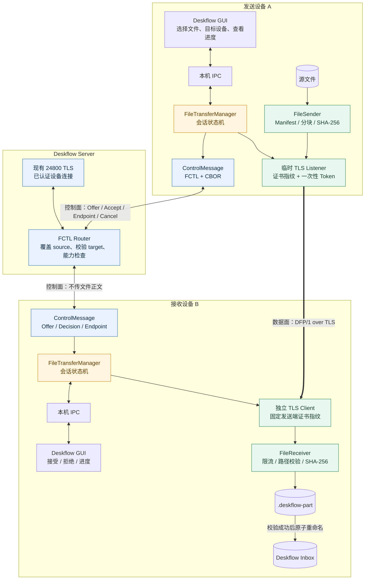
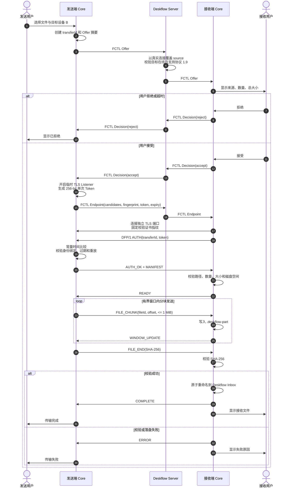
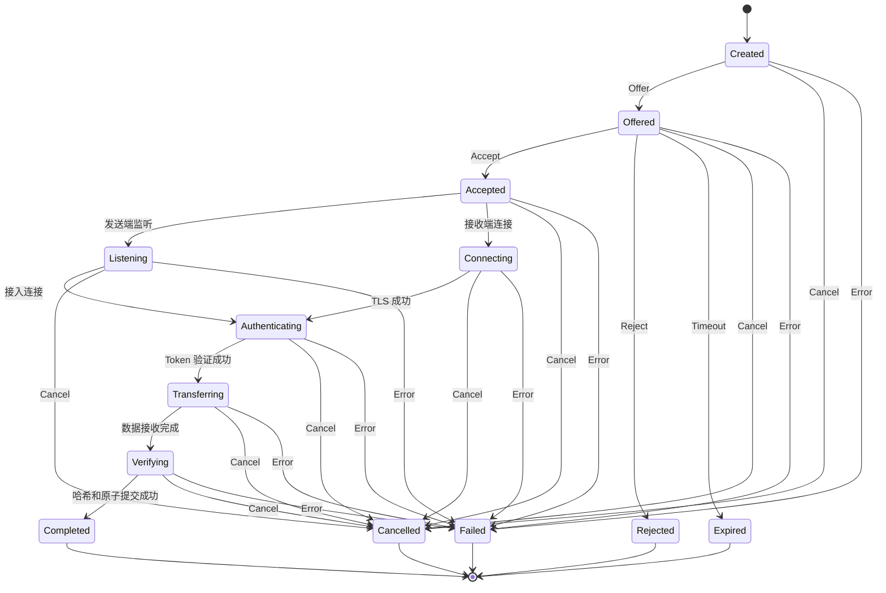

---
aliases:
  - Deskflow 隔空投送方案
  - Deskflow P2P File Transfer
tags:
  - deskflow
  - p2p
  - file-transfer
  - architecture
status: prototype
created: 2026-08-07
---

# Deskflow P2P 文件传输整体方案

> [!abstract] 结论
> 功能完全可行。推荐采用“现有 24800 TLS 主连接作为控制面、独立 TCP/TLS 连接作为数据面”的架构。Deskflow Server 只负责已认证设备之间的邀请、接受、端点和状态路由，文件正文由两台设备直接传输。第一版先实现显式发送、接收确认、进度和取消，再逐步加入多文件、目录、断点续传、剪贴板与拖拽。

## 一、为什么选择独立 P2P 数据通道

Deskflow 的键鼠事件对延迟非常敏感。把大文件放进现有 24800 TCP 流，会产生队头阻塞，即使对文件分片限流，慢网络和大文件仍可能让鼠标卡顿。

独立通道的职责划分：

| 通道 | 内容 | 特点 |
|---|---|---|
| 现有 24800 TLS 主通道 | Offer、接受/拒绝、端点、证书指纹、一次性 Token、取消、状态 | 消息小、保持键鼠实时性 |
| 独立 TCP/TLS 数据通道 | Manifest、文件分块、哈希、流控、完成状态 | 大吞吐、可取消、以后可续传 |

旧的 `DFTR/DDRG` 不应复活。Deskflow 当前虽然保留部分协议常量，但 `ClientProxy1_5` 中相关实现已经为空；旧拖拽功能也因全平台损坏被上游移除。新功能应建立协议 1.9 与新的 `FCTL` 控制消息。

## 二、总体架构图



## 三、完整发送时序



## 四、会话状态机



## 五、控制协议

建议将 Deskflow 协议从 1.8 升级到 1.9，并新增 `ClientProxy1_9`。旧客户端继续使用键鼠和普通剪贴板，但不显示文件发送入口。

只新增一个主协议消息：

```text
FCTL%s
```

`%s` 保存最大 64 KiB 的 CBOR envelope：

```text
{
  v: 1,
  type: offer | decision | endpoint | cancel | finished | error,
  id: 16-byte UUID,
  source: screen-name,
  target: screen-name,
  payload: {...}
}
```

约束：

- Server 必须以当前连接身份覆盖 `source`，不能信任客户端自报来源。
- Offer 只发送文件数量、总大小和简短预览，不发送巨大目录清单。
- 只有目标在线且协商到 1.9 时才能路由。
- 所有消息按 transferId 和状态机校验；过期、重复和乱序消息直接拒绝。

## 六、独立数据协议 DFP/1

```text
magic        4 bytes   "DFP1"
type         1 byte
flags        1 byte
headerLen    2 bytes   network byte order
payloadLen   4 bytes   network byte order
header       N bytes   bounded CBOR
payload      M bytes   raw bytes
```

| 帧 | 方向 | 用途 |
|---|---|---|
| `AUTH` | 接收端 → 发送端 | transferId、Token、能力 |
| `AUTH_OK/ERROR` | 发送端 → 接收端 | 认证结果 |
| `MANIFEST` | 发送端 → 接收端 | 完整文件清单 |
| `READY` | 接收端 → 发送端 | 准备完成、未来的续传范围 |
| `FILE_BEGIN` | 发送端 → 接收端 | fileId、相对路径、大小、mtime |
| `FILE_CHUNK` | 发送端 → 接收端 | fileId、offset、文件字节 |
| `FILE_END` | 发送端 → 接收端 | SHA-256 |
| `WINDOW_UPDATE` | 接收端 → 发送端 | 已落盘进度和窗口 |
| `TRANSFER_END` | 发送端 → 接收端 | 所有文件已发送 |
| `COMPLETE/ERROR/CANCEL` | 双向 | 结束状态 |

推荐默认 chunk 256 KiB，协议硬上限 1 MiB。发送窗口默认 8 MiB，文件读写和哈希进入有界工作线程，不阻塞 Deskflow 事件循环。

## 七、安全模型

现有 Deskflow TLS 通常是客户端验证服务端指纹，并不意味着任意两个客户端天然拥有可互相验证的证书身份。因此不能只写“复用 TLS”，还需要把临时数据连接绑定到已认证的主连接。

MVP 方案：

1. 文件传输使用单独的数据通道证书，不复用 Deskflow Server 主私钥。
2. 接收方接受后，发送端生成至少 256 bit 的随机 Token。
3. Token 绑定 `transferId + source + target + expiry`。
4. 证书 SHA-256 指纹和 Token 只通过已认证主通道下发。
5. 接收端固定校验证书指纹；不能忽略证书错误。
6. TLS 成功后立即发送 AUTH；发送端使用常量时间比较 Token。
7. Token 默认 60 秒过期，只能成功使用一次；认证失败需要限速。

文件系统安全：

- 只允许规范化相对路径；拒绝绝对路径、盘符、UNC、`..` 和 NUL。
- 最终路径必须仍位于接收根目录。
- 默认拒绝符号链接、硬链接、设备文件和特殊文件。
- 设置文件数、总大小、单文件大小、路径深度和文件名长度上限。
- 写入随机 `.deskflow-part`，校验成功后原子重命名。
- 同名默认使用 `name (1).ext`，不静默覆盖。
- 日志不记录 Token、私钥或文件内容。

## 八、网络连接策略

### MVP

发送端监听 `24810-24819` 或系统临时端口，接收端主动连接。发送端上报多个局域网 IPv4/IPv6 candidate，接收端快速顺序尝试。

### 第二阶段

若接收端无法连接发送端，则由接收端监听、发送端反向连接。Server 继续通过主通道路由新的端点、指纹和 Token。

### 可选中继

两个方向都失败时，可以增加 Server Relay。Relay 只转发端到端加密数据，并限制会话与带宽。第一版不建议实现，也不建议一开始引入 ICE/STUN/TURN/QUIC。

## 九、产品体验分阶段

1. **显式发送**：托盘菜单或快捷键选择文件，发送到当前屏幕或指定设备。
2. **多文件与目录**：接收弹窗、冲突策略、目录清单、符号链接默认禁用。
3. **断点续传**：`.part` 和 sidecar 记录完成范围，源文件变化后禁止错误续传。
4. **复制文件主动推送**：源端缓存文件引用，切换到目标屏幕后询问是否发送；完成后将接收端本地路径写入剪贴板。
5. **平台文件承诺**：Windows 虚拟文件、macOS File Promise；Wayland 按 compositor 能力降级。
6. **跨屏拖拽**：最后评估，因为它的跨平台维护成本最高。

## 十、源码模块与当前原型

代码原型位置：

```text
C:\Users\zq456\Documents\codex功能插件\deskflow\src\lib\filetransfer\
```

| 模块 | 文件 | 当前能力 |
|---|---|---|
| 控制消息 | `ControlMessage.*` | FCTL CBOR 编解码、64 KiB 限长、字段验证 |
| 数据帧 | `DataFrame.*` | DFP/1 编解码、增量输入、帧大小限制 |
| Manifest | `Manifest.*` | 文件清单、重复检查、总大小限制、CBOR |
| 路径安全 | `PathSanitizer.*` | 路径穿越、盘符、保留名和跨平台非法字符防护 |
| 一次性 Token | `TransferToken.*` | OpenSSL 随机数、身份绑定、过期、常量时间比较、防重放 |
| 状态机 | `TransferStateMachine.*` | 合法转移、终态、取消和失败 |
| 测试 | `src/unittests/filetransfer/FileTransferCoreTests.cpp` | 核心往返、限长、增量帧、Token、路径、Manifest、状态机 |

需要下一步接入的位置：

| Deskflow 位置 | 后续改动 |
|---|---|
| `ProtocolTypes.*` | 协议升级到 1.9，新增 `FCTL%s` |
| `ClientProxy1_9.*` | Server 侧收发文件控制消息 |
| `Server.*` | 路由 Offer/Decision/Endpoint，不读取文件正文 |
| `ServerProxy.*` / `Client.*` | Client 侧 FCTL 与 FileTransferManager 接入 |
| `SecureSocket.*` | 增加期望指纹/验证回调策略 |
| `deskflow/ipc/*` | Core 与 GUI 之间的邀请、进度、接受和取消 |
| `gui/dialogs/*` | 接收确认和传输中心 |
| `Settings.*` | 接收目录、端口范围、大小限制和自动接收策略 |

> [!warning] 当前边界
> 目前完成的是可独立审查的协议核心，还没有实现真实 TLS Listener、Server 路由、GUI 和剪贴板监听。不能把它描述成已经可在 Deskflow GUI 中传文件。

## 十一、开发里程碑

### Milestone 0：架构验证

- 独立 TLS listener/client 原型；
- Windows、macOS、Linux 两两传输 1 GiB 文件；
- 检查键鼠延迟、磁盘慢写和取消；
- 决定 SecureSocket 最小重构范围。

### Milestone 1：单文件 MVP

- 协议 1.9、FCTL 和 Server 路由；
- DFP/1 单文件数据通道；
- 指纹固定、一次性 Token 和超时；
- 固定接收目录、不覆盖；
- 最小 GUI：发起、接受、进度、取消。

### Milestone 2：可用产品

- 多文件、传输中心、冲突策略；
- 磁盘空间检查、限速、反向连接；
- 防火墙规则和网络诊断；
- 本地化和可访问性。

### Milestone 3：目录与续传

- 目录 Manifest；
- `.part` + sidecar；
- completed ranges；
- 崩溃恢复和陈旧临时文件清理。

### Milestone 4：剪贴板与拖拽

- Windows/macOS 优先；
- X11 次之；
- Wayland 按能力降级；
- 最后评估跨屏拖拽。

## 十二、验收标准

- 10 GiB 文件传输后 SHA-256 一致。
- 文件传输期间，稳定局域网下键鼠主通道 P95 延迟相对空闲增加不超过 5 ms。
- 内存不随文件大小线性增长，单会话默认缓冲不超过约 32 MiB。
- 取消后 1 秒内停止继续读取和发送大块数据。
- 指纹错误、Token 错误、过期和重放均被拒绝。
- 路径穿越、绝对路径、Windows 保留名和超大 Manifest 均被拒绝。
- 新旧 1.8/1.9 客户端可以混合连接；旧客户端不显示文件传输入口。
- 数据通道失败不得导致键鼠主连接断开。

## 十三、推荐提交顺序

1. **协议核心 PR**：当前 `filetransfer` 库、状态机、Codec 和安全单测。
2. **控制面 PR**：协议 1.9、FCTL、ClientProxy1_9 和 Server 路由。
3. **数据面 PR**：SecureSocket 验证策略、真实 Listener、单文件收发。
4. **最小产品 PR**：GUI、IPC、接收目录、进度和取消。
5. **增强 PR**：多文件、目录、续传、反向连接和剪贴板。

这样每一步都能独立测试和回滚，也比一次性提交网络、GUI、剪贴板和拖拽更容易被 Deskflow 上游审查。

